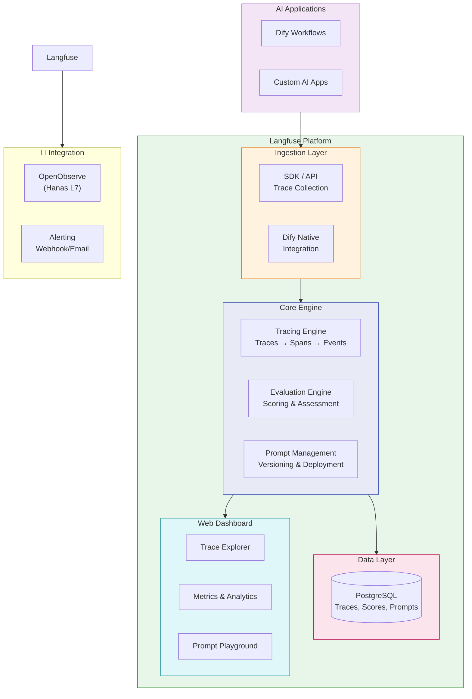
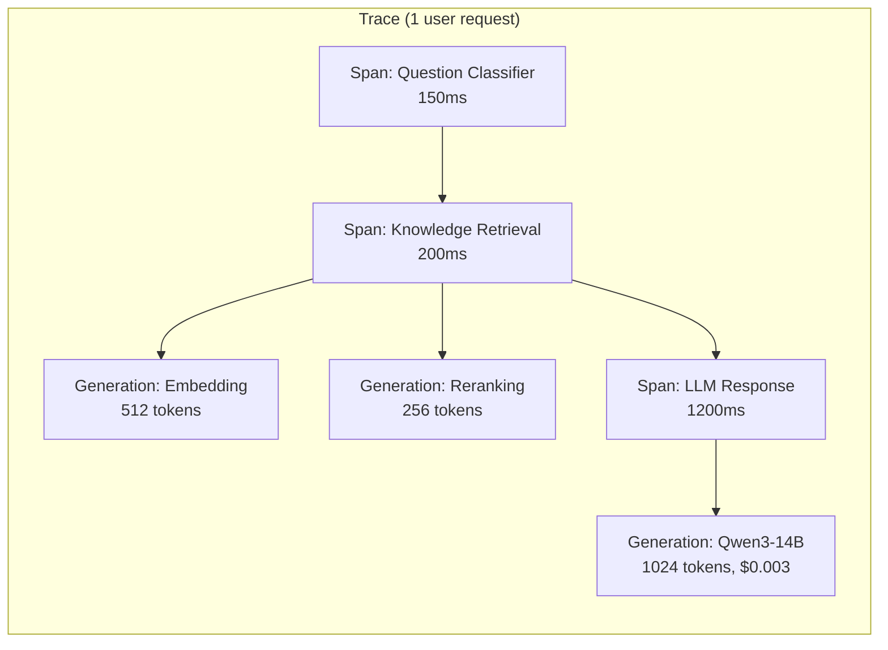

# Langfuse

## Tổng Quan

Langfuse là nền tảng **LLM Observability** mã nguồn mở, cung cấp khả năng tracing, evaluation và prompt management cho ứng dụng AI. Trong Hanas Platform, Langfuse đóng vai trò **giám sát toàn bộ AI workflows** — tracking hiệu suất, chi phí, chất lượng của các AI applications chạy trên Dify.

## Kiến Trúc

### Tracing Model

## Vai Trò Trong Platform

- **AI Observability**: Giám sát chi tiết mọi bước trong AI workflow
- **Cost Tracking**: Theo dõi token usage và chi phí inference
- **Quality Evaluation**: Đánh giá chất lượng câu trả lời AI
- **Prompt Optimization**: Versioning và so sánh hiệu suất prompts
- **Debug & Troubleshoot**: Truy vết lỗi trong multi-step workflows
- **Bổ sung cho OpenObserve** (L7): OpenObserve giám sát infrastructure, Langfuse giám sát AI quality

## Tính Năng Chính

1. **Tracing**: Record mọi LLM call, tool usage, agent action — inputs, outputs, latency, costs
2. **Evaluation**: Automated scoring (relevance, hallucination, toxicity) + human feedback
3. **Prompt Management**: Version control, A/B testing, deploy prompts without code changes
4. **Analytics Dashboard**: Token usage, cost breakdown, latency percentiles, error rates
5. **Dataset Management**: Curate datasets từ production traces cho testing
6. **Session Tracking**: Group traces theo user sessions
7. **Self-hosted**: Triển khai on-premise, dữ liệu không rời khỏi infrastructure

## Tài Liệu

- [Cài đặt & Triển khai](installation.md) — Docker Compose, Kubernetes
- [Cấu hình](configuration.md) — Dify integration, SDK setup, auth
- [Hướng dẫn sử dụng](user-guide.md) — Trace analysis, evaluation, prompt management
- [Best Practices](best-practices.md) — Evaluation strategies, alerting, data retention
- [Thông tin Version](version-info.md) — Version matrix, SDK compatibility
