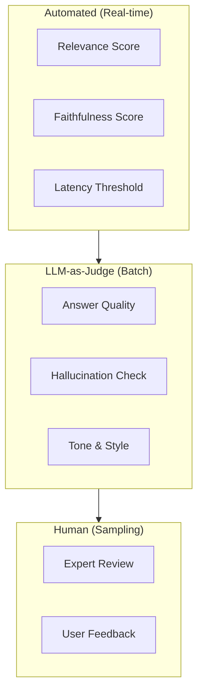
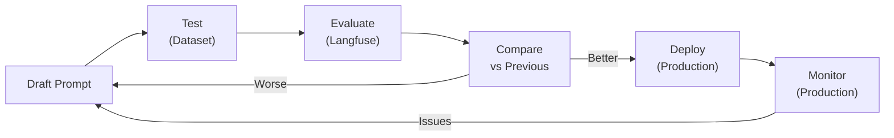

# Best Practices — Langfuse

## Evaluation Strategy

### Multi-layer Evaluation



| Layer | Frequency | Coverage | Cost |
|---|---|---|---|
| **Automated** | Mọi request | 100% | Thấp |
| **LLM-as-Judge** | Batch hàng giờ | 20-50% | Trung bình |
| **Human Review** | Sampling hàng tuần | 5-10% | Cao |

### Evaluation Metrics Cho Hanas AI

| Metric | Mô Tả | Target | Áp dụng cho |
|---|---|---|---|
| **Relevance** | Câu trả lời liên quan đến câu hỏi | ≥ 0.8 | Tất cả |
| **Faithfulness** | Trung thực với context (RAG) | ≥ 0.9 | Knowledge retrieval |
| **Completeness** | Đầy đủ thông tin | ≥ 0.7 | Q&A workflows |
| **Latency** | Thời gian phản hồi | ≤ 5s | Chatbot |
| **User Satisfaction** | Feedback từ end-user | ≥ 4/5 | Production |

## Prompt Iteration Workflow

### Quy Trình Chuẩn



### Best Practices

1. **Version mọi prompt** trong Langfuse
2. **Test trên dataset** trước khi deploy
3. **A/B test** với traffic splitting
4. **Monitor production metrics** sau deploy
5. **Rollback nhanh** nếu metrics giảm

## Alerting

### Alert Rules Khuyến Nghị

| Alert | Condition | Action |
|---|---|---|
| **High Latency** | P95 > 10s liên tục 5 phút | Check vLLM server load |
| **Low Quality** | Avg relevance < 0.6 trong 1 giờ | Review recent prompts |
| **High Error Rate** | Error rate > 5% trong 15 phút | Check service health |
| **Budget Exceeded** | Daily cost > threshold | Review token usage |
| **Hallucination Spike** | Faithfulness < 0.7 suddenly | Check Knowledge Base |

### Webhook Configuration

```bash
# Alert khi có vấn đề (tích hợp với Slack/Teams)
LANGFUSE_WEBHOOK_URL=https://hooks.slack.com/services/xxx/yyy/zzz
```

## Data Retention

### Storage Considerations

| Data Type | Retention | Lý Do |
|---|---|---|
| **Traces** | 90 ngày | Debugging và analysis |
| **Scores** | 1 năm | Trend analysis |
| **Prompts** | Vĩnh viễn | Version history |
| **Datasets** | Vĩnh viễn | Regression testing |

### Cleanup Policy

```sql
-- Xóa traces cũ hơn 90 ngày
DELETE FROM traces WHERE created_at < NOW() - INTERVAL '90 days';

-- Xóa observations không còn trace
DELETE FROM observations WHERE trace_id NOT IN (SELECT id FROM traces);
```

## Security

### API Key Management

- **Rotate keys** mỗi 90 ngày
- **Separate keys** cho dev/staging/production
- **Store trong Vault** (Hanas L9), không hard-code
- **Revoke ngay** khi nghi ngờ leak

### Data Privacy

- **Mask PII** trong inputs/outputs trước khi gửi traces
- **Tắt IO capture** cho sensitive functions:

```python
@observe(capture_input=False, capture_output=False)
def process_sensitive_data(data):
    # Input/output sẽ không được log
    return result
```

### Network Security

- Langfuse chỉ accessible trong **internal network**
- Dùng **reverse proxy** với TLS cho external access
- **Firewall**: chỉ cho phép Dify server → Langfuse

## Monitoring Langfuse Itself

### Infrastructure Monitoring (via OpenObserve)

| Metric | Threshold |
|---|---|
| **Langfuse Pod CPU** | < 80% |
| **PostgreSQL connections** | < max_connections * 0.8 |
| **Disk usage** | < 80% |
| **Ingestion latency** | < 500ms |

### Backup

```bash
# Backup Langfuse PostgreSQL
pg_dump -h langfuse-db -U langfuse -d langfuse \
  > langfuse_backup_$(date +%Y%m%d).sql
```
