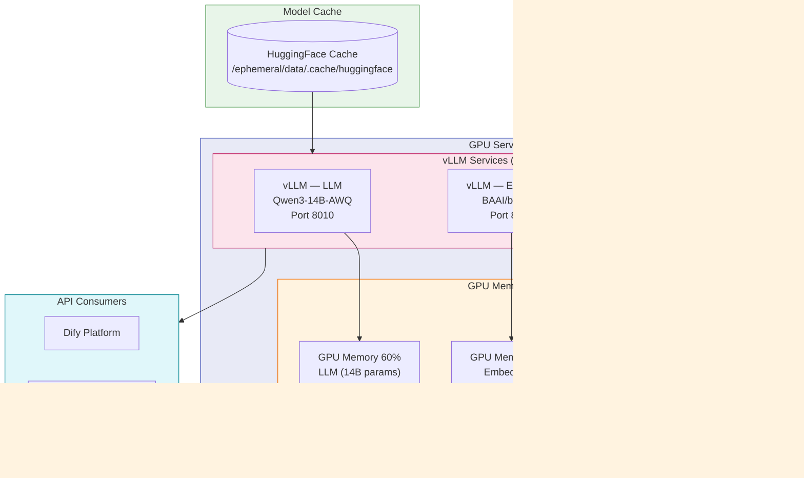

# vLLM

## Tổng Quan

vLLM là inference engine hiệu suất cao cho Large Language Models (LLM), sử dụng thuật toán **PagedAttention** để tối ưu bộ nhớ GPU và đạt throughput vượt trội. Trong Hanas Platform, vLLM đóng vai trò **LLM Inference Engine** — host các models AI và cung cấp OpenAI-compatible API cho Dify và các ứng dụng khác.

## Kiến Trúc

### Mô Hình Đóng Gói

| Thành phần | Mô tả |
|---|---|
| **Base image** | `<CẦN CHỐT TAG/DIGEST>` |
| **Custom image** | `<CẦN CHỐT TAG/DIGEST>` (build từ Dockerfile) |
| **Nightly vLLM** | Cài từ `wheels.vllm.ai/nightly` để hỗ trợ model mới |
| **Transformers** | Build từ source (`huggingface/transformers.git`) |
| **Extras** | `tqdm`, `rich`, `qwen-agent` |
| **Entrypoint** | `/app/start.sh` — Script khởi động linh hoạt |

### Models Đang Sử Dụng

| Model | Loại | Kích cỡ | GPU Memory | Port | Task |
|---|---|---|---|---|---|
| **Qwen/Qwen3-14B-AWQ** | LLM (Text Generation) | 14B params, AWQ quantized | 60% | 8010 | Chat/Completions |
| **BAAI/bge-m3** | Embedding | 568M params | 15% | 8017 | Embeddings |
| **BAAI/bge-reranker-v2-m3** | Reranker | 568M params | 15% | 8018 | Score/Rerank |

#### Models Bổ Sung (Backup)

| Model | Loại | Ghi chú |
|---|---|---|
| **Qwen/Qwen3-VL-4B-Instruct** | Vision-Language | Multimodal (image + text) |
| **Qwen/Qwen3-Coder-Next-GGUF** | Code Generation | GGUF quantized format |
| **GLMHF/glm-4-7b-flash** | LLM | Alternative model |
| **Qwen/Qwen3-Embedding-0.6B** | Embedding | Qwen3 series |
| **Qwen/Qwen3-Reranker-0.6B** | Reranker | Qwen3 series |

## Tính Năng Chính

1. **PagedAttention**: Quản lý KV cache theo pages, giảm lãng phí memory từ 60-80% xuống dưới 4%
2. **Continuous Batching**: Xử lý requests liên tục không cần chờ batch đầy
3. **OpenAI-compatible API**: Drop-in replacement cho OpenAI API
4. **Quantization Support**: AWQ, GPTQ, FP8, SqueezeLLM
5. **Tool Calling**: Hỗ trợ function calling (Hermes parser)
6. **Multi-model Serving**: Chạy song song LLM + Embedding + Reranker trên cùng GPU
7. **Health Checks**: Auto-recovery khi service gặp sự cố

## Vai Trò Trong Platform

- Cung cấp inference API cho **Dify** (chatbot, RAG, agent)
- Embedding cho **Knowledge Base** retrieval
- Reranking cho **RAG pipeline** quality improvement
- Hỗ trợ **AI Data Analytics** (text analysis, summarization)

## Tài Liệu

- [Cài đặt & Triển khai](installation.md) — Docker build, GPU setup, model download
- [Cấu hình](configuration.md) — Environment variables, memory tuning, model selection
- [Hướng dẫn sử dụng](user-guide.md) — API usage, test, monitoring
- [Best Practices](best-practices.md) — GPU optimization, multi-model, security
- [Thông tin Version](version-info.md) — Version matrix, model compatibility
