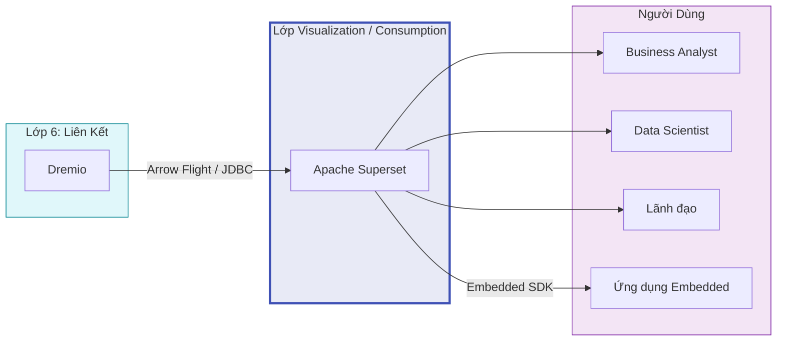

# Lớp Trực Quan Hóa Dữ Liệu (Data Visualization)

## Tổng Quan

Lớp trực quan hóa dữ liệu là lớp tiêu thụ cuối cùng trong kiến trúc Hanas Data Platform, nơi dữ liệu được chuyển đổi thành biểu đồ, dashboard và báo cáo phục vụ ra quyết định. Lớp này kết nối trực tiếp với **Dremio** (Layer 6 — Liên Kết Dữ Liệu) qua giao thức hiệu năng cao Apache Arrow Flight, cho phép truy vấn và trực quan hóa dữ liệu real-time mà không cần di chuyển hay sao chép dữ liệu.

## Services

- [Apache Superset](apache-superset/README.md) — BI Platform, Dashboard, SQL Lab, Alerts & Reports
