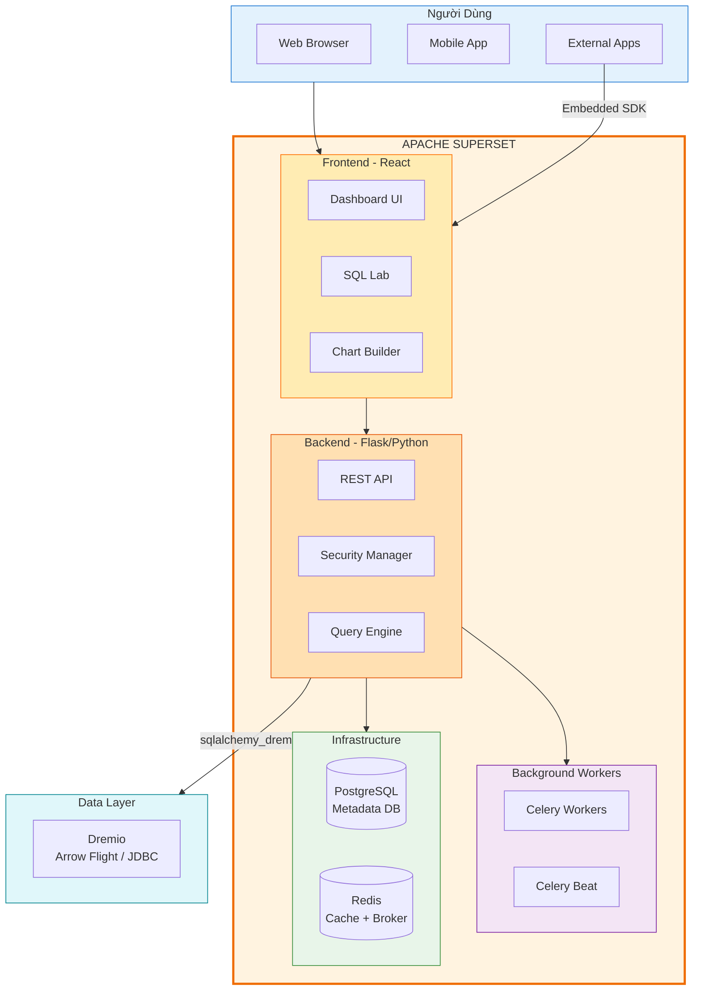

# Apache Superset

## Tổng Quan

Apache Superset là **nền tảng Business Intelligence (BI) mã nguồn mở** hàng đầu của Apache Software Foundation, đóng vai trò là lớp trực quan hóa dữ liệu (Data Visualization) trong Hanas Data Platform. Superset cung cấp giao diện web hiện đại cho phép tạo biểu đồ tương tác, dashboard real-time, SQL Lab, và hệ thống Alerts & Reports tự động.

Trong kiến trúc của Hanas Platform, Superset nằm ở **lớp tiêu thụ cuối cùng**, kết nối trực tiếp với **Dremio** (Layer 6) qua giao thức Apache Arrow Flight hiệu năng cao, cho phép truy vấn và trực quan hóa toàn bộ dữ liệu đã được chuẩn hóa trong Lakehouse mà không cần di chuyển dữ liệu.

## Kiến Trúc Trong Platform

## Vai Trò Trong Platform

| # | Vai trò | Mô tả |
|---|---|---|
| 1 | **BI Visualization** | 40+ loại biểu đồ tương tác (ECharts), tạo dashboard chuyên nghiệp |
| 2 | **SQL Lab** | Trình soạn SQL tương tác với autocomplete, chạy query trực tiếp trên Dremio |
| 3 | **Semantic Layer** | Định nghĩa Datasets (metrics, dimensions, calculated columns) cho self-service BI |
| 4 | **Dashboard Sharing** | Chia sẻ, nhúng (embed) dashboard vào ứng dụng bên ngoài qua SDK |
| 5 | **Alerts & Reports** | Lập lịch gửi báo cáo tự động qua email/Slack theo ngưỡng hoặc cron |
| 6 | **Row Level Security** | Bảo mật dữ liệu theo hàng, người dùng chỉ thấy dữ liệu được phân quyền |
| 7 | **Native Filters** | Cross-filter giữa các biểu đồ trong cùng dashboard |
| 8 | **API Automation** | REST API cho phép Airflow tự động quản lý charts, dashboards, datasets |

## Tính Năng Chính

| Tính năng | Mô tả |
|---|---|
| **40+ Chart Types** | ECharts-based: Bar, Line, Pie, Heatmap, Sankey, Sunburst, Treemap, Gauge, Radar, v.v. |
| **Interactive Dashboards** | Drag-and-drop layout, auto-refresh, native filters, cross-filters |
| **SQL Lab** | Multi-tab SQL editor, query history, saved queries, visualize trực tiếp kết quả |
| **Datasets & Metrics** | Virtual datasets, calculated columns, custom metrics, certification |
| **Alerts & Reports** | Lập lịch gửi screenshot/CSV dashboard qua email hoặc Slack |
| **Embedded Dashboards** | Nhúng dashboard vào ứng dụng bên ngoài qua JS SDK + guest token |
| **Row Level Security** | Giới hạn dữ liệu visible theo user/role thông qua RLS rules |
| **RBAC** | 5 built-in roles (Admin, Alpha, Gamma, sql_lab, Public) + custom roles |
| **Caching (Redis)** | Cache query results, dashboard metadata, filter states |
| **Async Queries** | Celery workers xử lý queries nặng bất đồng bộ |
| **REST API** | CRUD charts, dashboards, datasets, database connections programmatically |

## Luồng Dữ Liệu End-to-End

```mermaid
flowchart LR
    Oracle[(Oracle DB)]
    NiFi[Apache NiFi]
    Kafka[Apache Kafka]
    MinIO[(MinIO S3)]
    Spark[Spark + dbt]
    Iceberg[(Iceberg Tables)]
    Dremio[Dremio]
    Superset[Apache Superset]
    User[Người Dùng]

    Oracle -->|JDBC| NiFi
    NiFi -->|Ingest| Kafka
    Kafka -->|Stream| MinIO
    NiFi -->|Batch| MinIO

    MinIO -->|Read| Spark
    Spark -->|Write| Iceberg

    Iceberg -->|Catalog| Dremio
    Dremio -->|Arrow Flight| Superset
    Superset -->|Dashboard| User

    style Oracle fill:#e3f2fd,stroke:#1976d2
    style NiFi fill:#fff3e0,stroke:#ef6c00
    style Kafka fill:#fff3e0,stroke:#ef6c00
    style MinIO fill:#e8f5e9,stroke:#388e3c
    style Spark fill:#fce4ec,stroke:#c2185b
    style Iceberg fill:#e0f7fa,stroke:#00838f
    style Dremio fill:#fff8e1,stroke:#ff6f00
    style Superset fill:#e8eaf6,stroke:#3f51b5,stroke-width:3px
    style User fill:#f3e5f5,stroke:#7b1fa2
```

**Luồng chi tiết:**

1. **NiFi** thu thập dữ liệu từ Oracle → đẩy qua **Kafka** (streaming) hoặc trực tiếp vào **MinIO** (batch)
2. **Spark** (điều phối bởi **Airflow**) xử lý ETL/ELT → ghi **Iceberg tables**
3. **dbt** xây dựng Data Vault (Hub/Link/Satellite) và Data Mart trên Iceberg
4. **Dremio** đọc Iceberg tables → tạo Virtual Datasets + Reflections tăng tốc
5. **Superset** kết nối Dremio qua **Arrow Flight** → tạo charts và dashboards
6. **Người dùng** truy cập dashboards qua browser hoặc embedded SDK

## Tích Hợp Với Các Service

| Service | Tích hợp | Chi tiết |
|---|---|---|
| **Dremio** | Data Source (chính) | Kết nối qua `sqlalchemy_dremio` + Arrow Flight (port 32010), truy vấn toàn bộ Lakehouse |
| **Apache Iceberg** | Table Format | Superset truy vấn Iceberg tables thông qua Dremio (time travel, schema evolution) |
| **MinIO (S3)** | Object Storage | Dữ liệu vật lý lưu trên MinIO, Superset truy cập gián tiếp qua Dremio |
| **Apache Spark** | Compute | Spark xử lý dữ liệu → Superset trực quan hóa kết quả qua Dremio |
| **dbt** | Data Modeling | dbt tạo Data Mart → Superset tạo charts/dashboards trên các marts |
| **Apache Airflow** | Orchestration | Airflow gọi Superset REST API để warm cache, refresh datasets |
| **Apache Kafka** | Streaming | Kafka stream dữ liệu real-time → Iceberg → Dremio → Superset auto-refresh |
| **DataHub** | Governance | Metadata lineage: Superset dashboards/charts tracked trong DataHub catalog |
| **Apache Ranger** | Security | Row/column-level security policies áp dụng tại Dremio, Superset thêm RLS riêng |
| **HashiCorp Vault** | Secrets | Database credentials, SECRET_KEY, OAuth secrets lưu trong Vault |
| **OpenObserve** | Monitoring | Giám sát Superset pods (logs, metrics, traces) qua OpenObserve stack |
| **Apache NiFi** | Ingestion | NiFi thu thập dữ liệu nguồn → qua pipeline → đến Superset visualization |

## Tài Liệu

- [Cài đặt & Triển khai](installation.md) — System requirements, Helm chart, Docker Compose
- [Cấu hình](configuration.md) — Dremio connection, security, caching, Celery, feature flags
- [Hướng dẫn sử dụng](user-guide.md) — Charts, dashboards, SQL Lab, Alerts & Reports
- [Best Practices](best-practices.md) — Performance, security, dashboard design, operations
- [Thông tin Version](version-info.md) — Version matrix, compatibility, changelog
