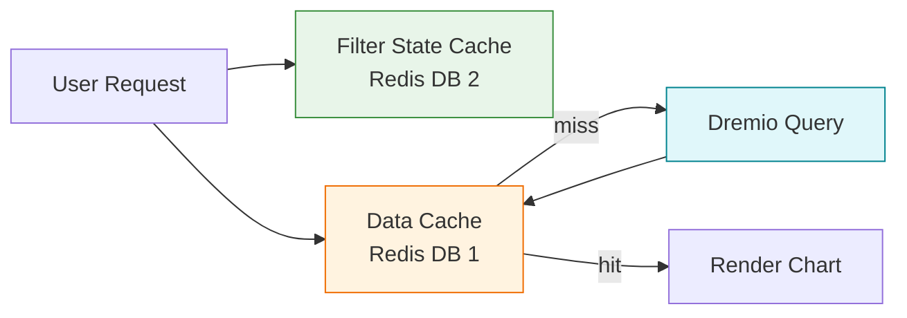
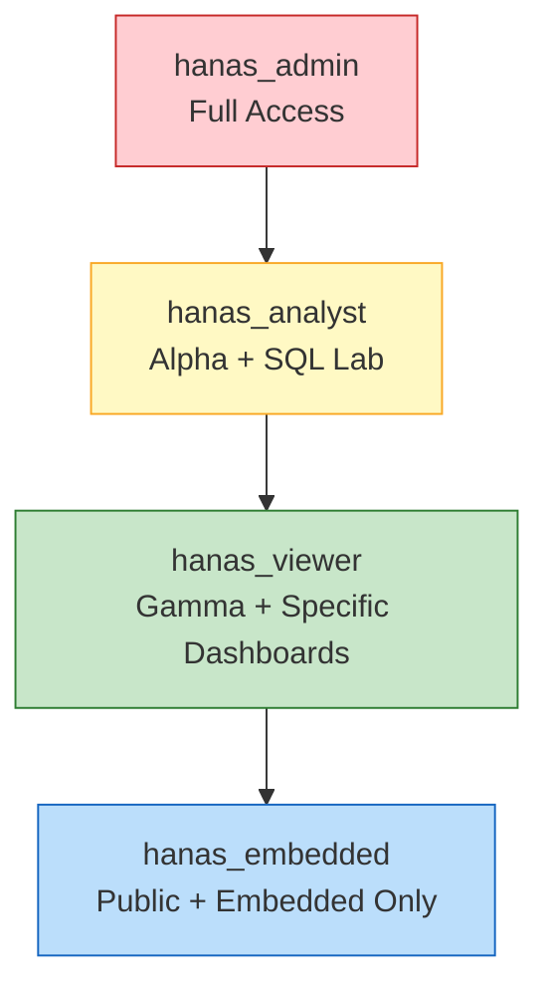
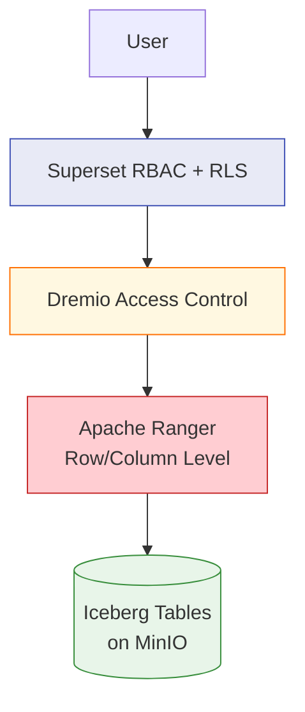

# Apache Superset - Best Practices

## Performance

### 1. Tận Dụng Dremio Reflections

Superset truy vấn Dremio — nên tối ưu tại Dremio thay vì Superset:

| Strategy | Mô tả | Khi nào |
|---|---|---|
| **Aggregation Reflections** | Pre-compute SUM, COUNT, AVG tại Dremio | Dashboard có metrics aggregated lớn |
| **Raw Reflections** | Sort và partition data cho scan nhanh hơn | Table scans thường xuyên |
| **Virtual Datasets** | Tạo views đơn giản hóa trên Dremio | Thay vì viết SQL phức tạp trong Superset |

> Dremio Reflections tự động tăng tốc — Superset không cần biết. Xem chi tiết tại [Dremio Best Practices](../../06-federation/dremio/best-practices.md).

### 2. Cache Strategy



| Cache Type | Timeout khuyến nghị | Mô tả |
|---|---|---|
| **Data Cache** | 1–24 hours | Cache query results, giảm load trên Dremio |
| **Filter State Cache** | 24 hours | Cache filter selections của user |
| **Dashboard Cache** | 1–6 hours | Cache rendered dashboard metadata |
| **Explore Cache** | 24 hours | Cache chart explore form data |

**Cache Warmup** — lập lịch warm cache cho top dashboards:

```python
# superset_config.py
beat_schedule = {
    'cache-warmup': {
        'task': 'cache-warmup',
        'schedule': crontab(minute='0', hour='6'),  # 6 AM daily
        'kwargs': {
            'strategy_name': 'top_n_dashboards',
            'top_n': 10,
        },
    },
}
```

### 3. Async Queries

Bật async queries cho SQL Lab để tránh timeout:

```python
# superset_config.py
SQLLAB_TIMEOUT = 300              # Sync timeout: 5 min
SQLLAB_ASYNC_TIME_LIMIT_SEC = 3600  # Async timeout: 1 hour
SQL_MAX_ROW = 100000
```

### 4. Chart Performance Tips

| Practice | Mô tả |
|---|---|
| **Limit rows** | Luôn set Row Limit (1000–10000) cho Table charts |
| **Tránh SELECT *** | Chỉ query columns cần thiết |
| **Partition pruning** | Sử dụng time filters để Dremio partition pruning |
| **Pre-aggregate** | Tạo summary tables/views trên Dremio cho heavy dashboards |
| **Reduce series** | Giới hạn số series trong Time Series charts (< 20) |
| **Auto-refresh** | Chỉ bật auto-refresh khi thực sự cần, interval tối thiểu 30s |

---

## Security Best Practices

### 1. Thiết Kế Role



| Nguyên tắc | Chi tiết |
|---|---|
| **Least Privilege** | Cấp quyền tối thiểu cần thiết cho mỗi role |
| **Dataset-level Access** | Gamma users chỉ thấy datasets được gán qua role |
| **Dashboard RBAC** | Bật `DASHBOARD_RBAC` để giới hạn dashboard visibility |
| **Tắt JavaScript Controls** | `ENABLE_JAVASCRIPT_CONTROLS = False` (ngăn XSS) |
| **SQL Lab Access** | Chỉ cấp `sql_lab` role cho users cần chạy ad-hoc queries |

### 2. Row Level Security Patterns

| Pattern | RLS Clause | Use Case |
|---|---|---|
| **Branch-based** | `branch_code = 'HN'` | User chỉ thấy data chi nhánh mình |
| **Region-based** | `region IN ('North', 'Central')` | User thấy data theo vùng |
| **Time-based** | `date >= CURRENT_DATE - 90` | Chỉ thấy data 90 ngày gần nhất |
| **Department-based** | `dept_code = '{{current_username()}}'` | Data theo department code = username |

### 3. Secrets Management

| Secret | Nơi lưu | Phương pháp |
|---|---|---|
| `SECRET_KEY` | HashiCorp Vault | Vault Agent Injector |
| Database Passwords | Kubernetes Secrets | `secretKeyRef` trong Helm values |
| OAuth Credentials | HashiCorp Vault | Environment variables từ Vault |
| SMTP Password | Kubernetes Secrets | `extraSecretEnv` |
| Slack API Token | Kubernetes Secrets | `extraSecretEnv` |

> **Cảnh báo:** **KHÔNG BAO GIỜ** hardcode secrets trong `superset_config.py`, `values.yaml`, hoặc commit vào Git.

### 4. Multi-layer Security



Hanas Platform áp dụng **security nhiều tầng**:
1. **Superset**: RBAC (role-based) + RLS (row-level) cho dashboards/charts
2. **Dremio**: Access control trên spaces, datasets, columns  
3. **Ranger**: Fine-grained row/column-level policies trên data sources

---

## Dashboard Design

### Naming Convention

| Loại | Format | Ví dụ |
|---|---|---|
| **Dashboard** | `[Domain] - [Tên Dashboard]` | `Sales - Monthly Revenue Overview` |
| **Chart** | `[Domain] [Chart Type] [Metric]` | `Sales Bar Revenue by Branch` |
| **Dataset** | `[Type]_[Domain]_[Description]` | `vds_sales_monthly_summary` |
| **Saved Query** | `[Domain]_[Purpose]` | `sales_top_customers` |

### Layout Guidelines

| Nguyên tắc | Chi tiết |
|---|---|
| **Big Numbers trên cùng** | KPIs chính ở hàng đầu tiên |
| **Filters bên trái** | Native Filters panel bên trái |
| **Time series giữa** | Trend charts ở giữa dashboard |
| **Detail tables dưới cùng** | Bảng chi tiết ở cuối |
| **Tabs cho nhóm nội dung** | Sử dụng tabs khi dashboard quá dài |
| **Màu sắc nhất quán** | Dùng CSS Templates cho color palette thống nhất |
| **Max 8–12 charts** | Quá nhiều charts gây chậm và khó đọc |

## Operations

### Monitoring

Giám sát Superset qua **OpenObserve**:

| Metric | Mô tả | Alert Threshold |
|---|---|---|
| **Pod CPU/Memory** | Resource usage của Superset pods | CPU > 80%, Memory > 85% |
| **Response Time** | API response latency | p95 > 5s |
| **Query Duration** | Thời gian chạy query trung bình | Avg > 30s |
| **Error Rate** | Tỷ lệ HTTP 5xx errors | > 1% |
| **Celery Queue** | Số tasks pending trong queue | > 100 |
| **Redis Memory** | Memory usage của Redis cache | > 80% allocated |

### Backup

| Component | Cần backup | Phương pháp | Tần suất |
|---|---|---|---|
| **PostgreSQL** | Charts, dashboards, users, permissions | `pg_dump` | Daily |
| **Redis** | Nice-to-have (cache, tự rebuild) | RDB/AOF | Optional |
| **superset_config.py** | Cấu hình | Git | Mỗi thay đổi |
| **Helm values** | Deployment config | Git | Mỗi thay đổi |

```bash
# Backup PostgreSQL metadata
kubectl exec -n superset superset-postgresql-0 -- \
  pg_dump -U superset -d superset > superset_backup_$(date +%Y%m%d).sql

# Restore
kubectl exec -i -n superset superset-postgresql-0 -- \
  psql -U superset -d superset < superset_backup_20260304.sql
```

### Scaling

| Component | Scale Strategy | Khi nào |
|---|---|---|
| **Superset App** | Tăng `replicaCount` | Nhiều concurrent users |
| **Celery Workers** | Tăng `supersetWorker.replicaCount` | Nhiều async queries, reports |
| **Redis** | Tăng memory, hoặc chuyển Redis Cluster | Cache size lớn |
| **PostgreSQL** | Vertical scaling (CPU/RAM) | Metadata DB lớn |

```bash
# Scale Superset Pods
kubectl scale deployment superset -n superset --replicas=4

# Scale Workers
kubectl scale deployment superset-worker -n superset --replicas=4
```

### Log Analysis

```bash
# Xem logs Superset App
kubectl logs -n superset -l app=superset --tail=100 -f

# Xem logs Celery Worker
kubectl logs -n superset -l app=superset-worker --tail=100 -f

# Xem logs Celery Beat
kubectl logs -n superset -l app=superset-celerybeat --tail=50

# Tìm slow queries
kubectl logs -n superset -l app=superset --tail=5000 \
  | grep -i "duration" | sort -t'=' -k2 -rn | head -20
```
