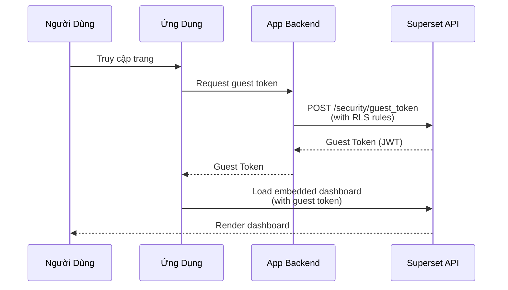

# Apache Superset - Hướng Dẫn Sử Dụng

## Giao Diện Tổng Quan

Sau khi đăng nhập, giao diện chính của Superset bao gồm:

| Thành phần | Mô tả |
|---|---|
| **Dashboards** | Danh sách dashboards, tìm kiếm, filter theo owner/tag |
| **Charts** | Danh sách biểu đồ đã tạo |
| **Datasets** | Quản lý datasets (tables, views, virtual datasets) |
| **SQL Lab** | Trình soạn SQL tương tác |
| **Settings** | Quản trị: Database Connections, Roles, RLS, CSS Templates |

---

## Quản Lý Datasets

### Dataset là gì?

Dataset là nguồn dữ liệu cơ bản để tạo biểu đồ. Trong Hanas Platform, datasets được tạo từ các tables/views trên **Dremio**.

### Tạo Dataset Mới

1. **Datasets** → Click **+ Dataset**
2. Chọn:
   - **Database**: `Dremio Hanas`
   - **Schema**: `DATA_MART` (hoặc schema phù hợp)
   - **Table**: Chọn table/view từ danh sách
3. Click **Create Dataset and Create Chart** (hoặc chỉ **Create Dataset**)

### Physical vs Virtual Dataset

| Loại | Mô tả | Khi nào dùng |
|---|---|---|
| **Physical** | Map trực tiếp tới 1 table/view trên Dremio | Dữ liệu đã sẵn sàng |
| **Virtual** | Dựa trên SQL query tùy chỉnh | Cần join, transform, aggregate |

### Tạo Virtual Dataset

1. Mở **SQL Lab** → viết query:

```sql
SELECT
    dc.customer_name,
    dc.branch_code,
    fs.transaction_date,
    fs.amount,
    dp.product_category
FROM "DATA_MART".fact_sales fs
JOIN "DATA_MART".dim_customer dc ON fs.customer_key = dc.customer_key
JOIN "DATA_MART".dim_product dp ON fs.product_key = dp.product_key
WHERE fs.transaction_date >= CURRENT_DATE - INTERVAL '90' DAY
```

2. Click **Run** để verify kết quả
3. Click **Save** → **Save as new** → chọn **Save as Dataset**
4. Đặt tên: `vds_sales_last_90days`

### Cấu Hình Metrics & Columns

Sau khi tạo dataset, vào **Edit Dataset** để cấu hình:

**Columns:**

| Cấu hình | Mô tả |
|---|---|
| **Filterable** | Cho phép dùng làm filter trên dashboard |
| **Groupable** | Cho phép dùng trong GROUP BY |
| **Type** | Kiểu dữ liệu: STRING, INT, FLOAT, DATETIME |
| **Certified** | Đánh dấu đã được kiểm duyệt |

**Metrics:**

| Metric | Expression | Mô tả |
|---|---|---|
| `total_amount` | `SUM(amount)` | Tổng doanh thu |
| `avg_amount` | `AVG(amount)` | Doanh thu trung bình |
| `order_count` | `COUNT(*)` | Số lượng giao dịch |
| `unique_customers` | `COUNT(DISTINCT customer_key)` | Số khách hàng unique |

---

## Tạo Biểu Đồ (Charts)

### Quy Trình Tạo Chart

1. **Charts** → **+ Chart**
2. Chọn **Dataset**: `vds_sales_last_90days`
3. Chọn **Chart Type** từ gallery
4. Cấu hình chart parameters
5. Click **Create Chart** / **Update Chart**

### Các Loại Biểu Đồ Phổ Biến

#### 1. Table (Bảng)

| Cấu hình | Giá trị ví dụ |
|---|---|
| **Columns** | `customer_name`, `branch_code`, `amount` |
| **Metrics** | `SUM(amount)` |
| **Filters** | `transaction_date >= last month` |
| **Row Limit** | 1000 |
| **Search** | Enable server-side search |

#### 2. Bar Chart (Biểu đồ cột)

| Cấu hình | Giá trị ví dụ |
|---|---|
| **X-Axis** | `branch_code` |
| **Metrics** | `SUM(amount)` |
| **Series** | `product_category` (grouped/stacked) |
| **Sort** | Descending by metric |

#### 3. Line Chart (Biểu đồ đường)

| Cấu hình | Giá trị ví dụ |
|---|---|
| **X-Axis** | `transaction_date` (Time Grain: Month) |
| **Metrics** | `SUM(amount)`, `COUNT(*)` |
| **Series** | `branch_code` |

#### 4. Pie Chart (Biểu đồ tròn)

| Cấu hình | Giá trị ví dụ |
|---|---|
| **Dimensions** | `product_category` |
| **Metric** | `SUM(amount)` |
| **Show Labels** | Percentage + Value |

#### 5. Big Number (Số lớn)

| Cấu hình | Giá trị ví dụ |
|---|---|
| **Metric** | `SUM(amount)` |
| **Temporal Column** | `transaction_date` |
| **Time Comparison** | Previous period |

#### 6. Heatmap

| Cấu hình | Giá trị ví dụ |
|---|---|
| **X-Axis** | Ngày trong tuần |
| **Y-Axis** | Giờ trong ngày |
| **Metric** | `COUNT(*)` |

#### 7. Sankey Diagram

| Cấu hình | Giá trị ví dụ |
|---|---|
| **Source** | `source_channel` |
| **Target** | `product_category` |
| **Metric** | `SUM(amount)` |

#### 8. Treemap

| Cấu hình | Giá trị ví dụ |
|---|---|
| **Dimensions** | `region` → `branch_code` (hierarchical) |
| **Metric** | `SUM(amount)` |

### Bảng Tổng Hợp Chart Types

| Nhóm | Chart Types |
|---|---|
| **Basic** | Table, Big Number, Big Number with Trendline |
| **Time Series** | Line, Area, Bar, Mixed Time-series |
| **Categorical** | Bar, Pie, Donut, Funnel, Gauge, Radar |
| **Advanced** | Heatmap, Histogram, Sankey, Sunburst, Treemap, Tree |
| **Geospatial** | World Map, Country Map |
| **Statistical** | Box Plot, Pivot Table |
| **Relationship** | Graph (Force-directed), Chord Diagram |

---

## Tạo Dashboard

### Quy Trình Tạo Dashboard

1. **Dashboards** → **+ Dashboard**
2. Click **Edit dashboard** (biểu tượng bút chì)
3. Kéo thả charts từ panel bên phải vào canvas
4. Sắp xếp layout: resize, reorder
5. Thêm **Tabs**, **Rows**, **Columns**, **Headers**, **Dividers**
6. Click **Save**

### Cấu Hình Dashboard

| Cấu hình | Mô tả |
|---|---|
| **Title** | Tên dashboard hiển thị |
| **Slug** | URL-friendly identifier |
| **Owners** | Users quản lý dashboard |
| **Roles** | Roles được phép xem (khi DASHBOARD_RBAC bật) |
| **JSON Metadata** | Cấu hình nâng cao: refresh intervals, filter scoping |
| **Published** | Publish để users khác thấy |

### Native Filters

Native Filters cho phép tạo bộ lọc tương tác trên dashboard:

1. Click biểu tượng **Filter** trên dashboard toolbar
2. Click **+ Add Filters**
3. Cấu hình filter:
   - **Filter Type**: Value, Time Range, Time Column, Time Grain
   - **Dataset**: Chọn dataset nguồn
   - **Column**: Cột filter
   - **Default Value**: Giá trị mặc định
   - **Scope**: Charts nào bị ảnh hưởng bởi filter
   - **Dependencies**: Filter phụ thuộc (cascading)

**Ví dụ cascading filters:**

```
Branch Filter (branch_code)
  └── Department Filter (dept_code) — phụ thuộc Branch
        └── Date Range Filter (transaction_date)
```

### Cross-Filters

Cross-filters cho phép click vào 1 biểu đồ để filter tất cả biểu đồ khác:

1. Bật trong `superset_config.py`:
```python
FEATURE_FLAGS = {
    'DASHBOARD_CROSS_FILTERS': True,
}
```

2. Trên dashboard, click vào data point trên chart A → tự động filter charts B, C, D

---

## SQL Lab

### Tính Năng Chính

| Tính năng | Mô tả |
|---|---|
| **Multi-tab Editor** | Mở nhiều tab query đồng thời |
| **Autocomplete** | Gợi ý table names, columns, SQL keywords |
| **Query History** | Lịch sử queries đã chạy |
| **Saved Queries** | Lưu queries để tái sử dụng |
| **Visualize** | Tạo chart trực tiếp từ query results |
| **Export** | Xuất kết quả ra CSV |
| **Async Mode** | Chạy query nặng bất đồng bộ qua Celery |

### Sử Dụng SQL Lab

1. Chọn **SQL Lab** → **SQL Editor**
2. Chọn **Database**: `Dremio Hanas`
3. Chọn **Schema**: `DATA_MART`
4. Viết query:

```sql
-- Top 10 khách hàng theo doanh thu
SELECT
    dc.customer_name,
    dc.branch_code,
    SUM(fs.amount) as total_revenue,
    COUNT(*) as transaction_count,
    AVG(fs.amount) as avg_transaction
FROM "DATA_MART".fact_sales fs
JOIN "DATA_MART".dim_customer dc
    ON fs.customer_key = dc.customer_key
WHERE fs.transaction_date >= CURRENT_DATE - INTERVAL '30' DAY
GROUP BY dc.customer_name, dc.branch_code
ORDER BY total_revenue DESC
LIMIT 10
```

5. Click **Run** (hoặc `Ctrl/Cmd + Enter`)
6. Xem kết quả → **Visualize** để tạo chart → **Save as Dataset** để lưu

### Jinja Templates

Khi `ENABLE_TEMPLATE_PROCESSING = True`, SQL Lab hỗ trợ Jinja templates:

```sql
-- Sử dụng filter template
SELECT *
FROM "DATA_MART".fact_sales
WHERE transaction_date >= '{{ from_dttm }}'
  AND transaction_date < '{{ to_dttm }}'
  
  AND branch_code IN ({{ "'" + "','".join(filter_values('branch_code')) + "'" }})
  
```

---

## Alerts & Reports

### Tổng Quan

Alerts & Reports cho phép lập lịch gửi dashboard/chart screenshots hoặc CSV data qua email hoặc Slack.

| Loại | Mô tả |
|---|---|
| **Report** | Gửi screenshot hoặc CSV theo lịch cố định (cron) |
| **Alert** | Gửi thông báo khi điều kiện SQL được thỏa mãn |

### Prerequisites

- ✅ `FEATURE_FLAGS['ALERT_REPORTS'] = True`
- ✅ Celery Worker + Beat đang chạy
- ✅ SMTP hoặc Slack API Token đã cấu hình
- ✅ Selenium + Chromium headless (cho screenshot, đã có trong Docker image)

### Tạo Report

1. Mở dashboard hoặc chart cần report
2. Click **⋮** (menu) → **Set up a report** (hoặc **Manage reports**)
3. Cấu hình:
   - **Report Name**: Tên báo cáo
   - **Type**: Dashboard / Chart
   - **Schedule**: Cron expression (ví dụ: `0 8 * * 1-5` = 8h sáng thứ 2-6)
   - **Timezone**: `Asia/Ho_Chi_Minh`
   - **Report Format**: Screenshot (PNG) / CSV / Text
   - **Recipients**: Email addresses hoặc Slack channel
4. Click **Add**

### Tạo Alert

1. **Settings** → **Alerts & Reports** → **+ Alert**
2. Cấu hình:
   - **Alert Name**: Tên cảnh báo
   - **Database**: `Dremio Hanas`
   - **SQL Query**: Điều kiện kiểm tra

```sql
-- Cảnh báo khi doanh thu ngày giảm > 20% so với trung bình
SELECT
    CASE
        WHEN today_revenue < avg_revenue * 0.8 THEN 1
        ELSE 0
    END as alert_trigger
FROM (
    SELECT
        SUM(CASE WHEN transaction_date = CURRENT_DATE THEN amount ELSE 0 END) as today_revenue,
        AVG(daily_total) as avg_revenue
    FROM (
        SELECT transaction_date, SUM(amount) as daily_total
        FROM "DATA_MART".fact_sales
        WHERE transaction_date >= CURRENT_DATE - INTERVAL '30' DAY
        GROUP BY transaction_date
    )
)
```

   - **Alert Condition**: `result > 0`
   - **Schedule**: `0 */1 * * *` (mỗi giờ)
   - **Dashboard/Chart**: Attach screenshot khi alert trigger
   - **Recipients**: Email/Slack
3. Click **Add**

---

## Embedded Dashboards

### Luồng Hoạt Động



### Các Bước Cài Đặt

1. **Bật Embedded** trên dashboard:
   - Mở dashboard → **⋮** → **Embed dashboard**
   - Copy **Dashboard UUID**

2. **Backend** tạo guest token (xem [configuration.md](configuration.md#embedded-dashboards))

3. **Frontend** nhúng dashboard:

```javascript
import { embedDashboard } from "@superset-ui/embedded-sdk";

embedDashboard({
  id: "DASHBOARD_UUID",
  supersetDomain: "https://superset.hanas.local",
  mountPoint: document.getElementById("dashboard-container"),
  fetchGuestToken: async () => {
    const response = await fetch("/api/guest-token");
    const data = await response.json();
    return data.token;
  },
  dashboardUiConfig: {
    hideTitle: true,
    hideChartControls: false,
    hideTab: false,
    filters: {
      visible: true,
      expanded: false,
    },
  },
});
```

---

## REST API

### Authentication

```bash
# Step 1: Login để lấy access token
TOKEN=$(curl -s -X POST http://superset:8088/api/v1/security/login \
  -H "Content-Type: application/json" \
  -d '{"username": "admin", "password": "<PASSWORD>", "provider": "db"}' \
  | jq -r '.access_token')

# Step 2: CSRF token
CSRF=$(curl -s http://superset:8088/api/v1/security/csrf_token/ \
  -H "Authorization: Bearer $TOKEN" \
  | jq -r '.result')
```

### API Endpoints Chính

| Endpoint | Method | Mô tả |
|---|---|---|
| `/api/v1/dashboard/` | GET | Liệt kê dashboards |
| `/api/v1/chart/` | GET | Liệt kê charts |
| `/api/v1/dataset/` | GET/POST | Quản lý datasets |
| `/api/v1/database/` | GET/POST | Quản lý database connections |
| `/api/v1/security/login` | POST | Đăng nhập lấy JWT token |
| `/api/v1/security/guest_token/` | POST | Tạo guest token cho embed |

### Ví Dụ: Airflow Warm Cache

```python
# Airflow DAG - warm Superset cache mỗi sáng
from airflow import DAG
from airflow.operators.python import PythonOperator
from datetime import datetime
import requests

def warm_superset_cache():
    # Login
    session = requests.Session()
    resp = session.post(
        'http://superset:8088/api/v1/security/login',
        json={'username': 'airflow_svc', 'password': '<PASSWORD>', 'provider': 'db'}
    )
    token = resp.json()['access_token']

    # Refresh dashboard
    session.headers.update({'Authorization': f'Bearer {token}'})
    session.put(
        'http://superset:8088/api/v1/dashboard/warm_up_cache',
        json={'dashboard_id': 1}
    )

with DAG('superset_cache_warmup', schedule='0 6 * * *',
         start_date=datetime(2026, 1, 1), catchup=False) as dag:
    warm_cache = PythonOperator(
        task_id='warm_cache',
        python_callable=warm_superset_cache,
    )
```
