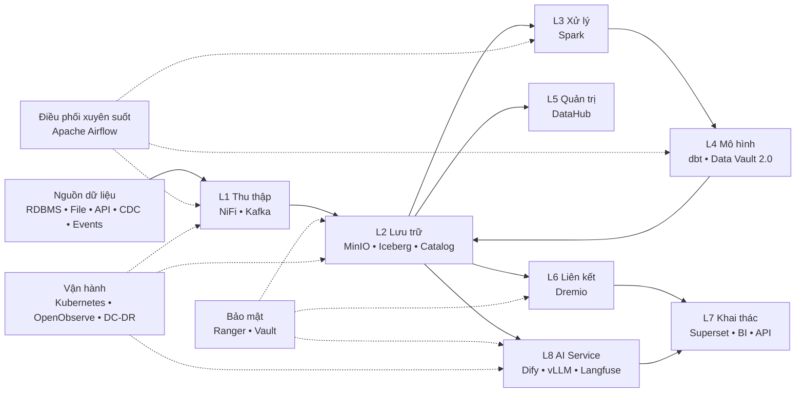

# Hanas Data Platform

> **Nền tảng dữ liệu hợp nhất (Data Lakehouse) và dịch vụ AI** cho việc tiếp nhận, lưu trữ, xử lý, quản trị và khai thác dữ liệu doanh nghiệp.

Trang này là điểm bắt đầu của bộ tài liệu. Tài liệu được chia thành các lớp chức năng và các năng lực dùng chung. Mỗi service có bộ trang chuẩn gồm tổng quan, cài đặt, cấu hình, hướng dẫn sử dụng, best practices và thông tin phiên bản.

## Phạm vi nền tảng

Hanas cung cấp một luồng dữ liệu thống nhất từ hệ thống nguồn đến báo cáo, ứng dụng và AI. Các thành phần được triển khai độc lập, kết nối qua giao thức mở; Kubernetes, bảo mật, giám sát và khôi phục thảm họa là các năng lực xuyên suốt.

> **Quy ước:** Airflow là năng lực điều phối dùng chung, không phải một vùng dữ liệu. Kubernetes, Apache Ranger, HashiCorp Vault, OpenObserve và DC-DR là các năng lực nền tảng/xuyên suốt. Chi tiết và phạm vi thực tế cần đối chiếu với BOM/manifest của từng môi trường.

## Danh mục tài liệu

| # | Lớp | Mô Tả | Services |
|---|-----|-------|----------|
| **00** | [Tổng Quan](00-overview/README.md) | Giới thiệu, kiến trúc, mục tiêu | - |
| **01** | [Thu Thập Dữ Liệu](01-ingestion/README.md) | Batch & Streaming ingestion | NiFi, Kafka |
| **02** | [Lưu Trữ Dữ Liệu](02-storage/README.md) | Object Storage, table format và catalog | MinIO, Iceberg, Polaris/Hive |
| **03** | [Xử Lý Dữ Liệu](03-processing/README.md) | Distributed compute | Spark |
| **04** | [Mô Hình Dữ Liệu](04-data-model/README.md) | Data Vault 2.0 & Transformations | dbt |
| **05** | [Quản Trị Dữ Liệu](05-governance/README.md) | Metadata & Lineage | DataHub |
| **06** | [Liên Kết Dữ Liệu](06-federation/README.md) | Query Engine & Semantic Layer | Dremio |
| **07** | [Khai Thác & Trực Quan Hóa](13-visualization/README.md) | Dashboard, BI và data consumption | Superset |
| **08** | [AI Service](12-ai-service/README.md) | AI workflow, inference & observability | Dify, vLLM, Langfuse |

Năng lực xuyên suốt:

- [Điều phối](14-orchestration/README.md) — Apache Airflow.
- [Quản trị hệ thống](07-system-management/README.md) — OpenObserve.
- [Hạ tầng & DC-DR](08-infrastructure/README.md) — Kubernetes, Velero, Site Replication.
- [An toàn thông tin](09-security/README.md) — Apache Ranger, HashiCorp Vault, xác thực và phân quyền.

## Bắt đầu theo vai trò

| Vai trò | Nên bắt đầu từ |
|---|---|
| Lãnh đạo/nghiệp vụ | [Tổng quan](00-overview/README.md) → [Kiến trúc](00-overview/architecture.md) → [Use case end-to-end](guides/end-to-end-tutorial.md) |
| Quản trị hạ tầng | [Baseline triển khai](00-overview/platform-baseline.md) → [Kubernetes](08-infrastructure/kubernetes/README.md) → [DC-DR](08-infrastructure/dc-dr/README.md) |
| Data engineer | [Quickstart](guides/quickstart.md) → [Integration guides](guides/README.md) → tài liệu NiFi/Kafka/Spark/dbt |
| Data steward/governance | [DataHub](05-governance/datahub/README.md) → [Quản trị dữ liệu](05-governance/README.md) |
| BI/data consumer | [Dremio](06-federation/dremio/README.md) → [Superset](13-visualization/apache-superset/README.md) |
| AI engineer | [AI Service](12-ai-service/README.md) → [Dify + vLLM + Langfuse](guides/integration/dify-vllm-langfuse.md) |

## Nguyên tắc sử dụng tài liệu

- Không đưa credentials, token, private key hoặc dữ liệu khách hàng thật vào code block, Git hay ticket.
- Các giá trị dạng `<...>`, `{{...}}` và `EXAMPLE_*` là biến cần thay bằng cấu hình của môi trường; không phải thông tin truy cập thật.
- Chỉ coi một service là **đã triển khai** khi image tag/digest, namespace, endpoint và owner đã được xác nhận trong manifest/baseline bàn giao.
- Profile catalog phải được chốt trước khi tạo bảng: [Hive Metastore cho quickstart/dev](02-storage/apache-iceberg/README.md) hoặc [Apache Polaris cho production](02-storage/data-catalog/README.md).
- Các cam kết dịch vụ, RPO/RTO và retention chỉ có hiệu lực khi được ghi trong hợp đồng/biên bản nghiệm thu.

## Tài liệu bàn giao cần chốt

Trước khi gửi bộ tài liệu chính thức, điền các mục trong [Baseline triển khai](00-overview/platform-baseline.md): môi trường, phiên bản image/digest, namespace, endpoint, sizing, chính sách bảo mật, RPO/RTO, retention, owner, kênh hỗ trợ và biên bản nghiệm thu. Các trang cài đặt là runbook tham chiếu; không thay thế manifest hoặc quy trình change management của khách hàng.

## Hướng dẫn thực hành

| Loại | Nội Dung |
|------|----------|
| **Integration** | [NiFi → MinIO](guides/integration/nifi-to-minio.md), [Airflow + Spark](guides/integration/airflow-spark-pipeline.md), [dbt + Data Vault](guides/integration/dbt-data-vault.md), [Dify + vLLM + Langfuse](guides/integration/dify-vllm-langfuse.md) |
| **Examples** | [NiFi Flow](guides/examples/sample-nifi-flow.md), [Airflow DAG](guides/examples/sample-airflow-dag.md), [Spark Job](guides/examples/sample-spark-job.md), [Dify Workflow](guides/examples/sample-dify-workflow.md) |
| **Troubleshooting** | [Xử lý sự cố](guides/troubleshooting.md) |

© 2026 Hanas Data Platform
