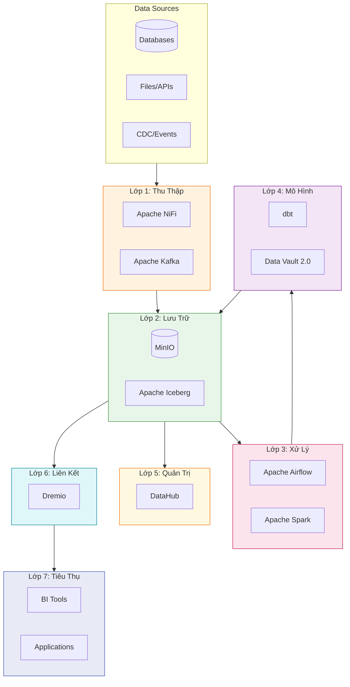

# Hanas Data Platform

> **Nền tảng Dữ liệu Hợp nhất (Data Lakehouse) + AI Service** - Giải pháp toàn diện cho quản trị dữ liệu và ứng dụng AI doanh nghiệp

## Tổng Quan

Hanas Data Platform là nền tảng dữ liệu hợp nhất (Data Lakehouse), được thiết kế để tiếp nhận, lưu trữ, xử lý và quản trị dữ liệu một cách thống nhất. Nền tảng kết hợp linh hoạt giữa lưu trữ Data Lake và quản trị Data Warehouse, phân tách thành 7 lớp từ thu thập đến tiêu thụ dữ liệu.

## Kiến Trúc 7 Lớp

## 📚 Danh Mục Tài Liệu

| # | Lớp | Mô Tả | Services |
|---|-----|-------|----------|
| **00** | [Tổng Quan](00-overview/README.md) | Giới thiệu, kiến trúc, mục tiêu | - |
| **01** | [Thu Thập Dữ Liệu](01-ingestion/README.md) | Batch & Streaming ingestion | NiFi, Kafka |
| **02** | [Lưu Trữ Dữ Liệu](02-storage/README.md) | Object Storage & Table Format | MinIO, Iceberg |
| **03** | [Xử Lý Dữ Liệu](03-processing/README.md) | Orchestration & Compute | Airflow, Spark |
| **04** | [Mô Hình Dữ Liệu](04-data-model/README.md) | Data Vault 2.0 & Transformations | dbt |
| **05** | [Quản Trị Dữ Liệu](05-governance/README.md) | Metadata & Lineage | DataHub |
| **06** | [Liên Kết Dữ Liệu](06-federation/README.md) | Query Engine & Semantic Layer | Dremio |
| **07** | [Quản Trị Hệ Thống](07-system-management/README.md) | Monitoring & Logging | OpenObserve |
| **08** | [Hạ Tầng](08-infrastructure/README.md) | Kubernetes & DC-DR | K8s, Velero |
| **09** | [An Toàn Thông Tin](09-security/README.md) | Security & Access Control | Ranger, Vault |
| **10** | [Đào Tạo](10-training/README.md) | Training materials | - |
| **11** | [Bảo Hành & Bảo Trì](11-maintenance/README.md) | SLA & Maintenance | - |
| **12** | [AI Service](12-ai-service/README.md) | AI Workflow, Inference & Observability | Dify, vLLM, Langfuse |

## Bắt Đầu Nhanh

- [Quickstart Guide](guides/quickstart.md) - Dựng môi trường và chạy data flow đầu tiên
- [End-to-End Tutorial](guides/end-to-end-tutorial.md) - Tutorial đầy đủ từ Source → BI
- [Kiến Trúc Tổng Thể](00-overview/architecture.md) - Hiểu rõ kiến trúc 7 lớp

## Công Nghệ Sử Dụng

### Core Platform
- **Apache NiFi** - Data ingestion và ETL visual
- **Apache Kafka** - Streaming platform
- **MinIO** - S3-compatible object storage
- **Apache Iceberg** - Open table format
- **Apache Airflow** - Workflow orchestration
- **Apache Spark** - Distributed compute engine
- **dbt** - Data transformations
- **DataHub** - Metadata management
- **Dremio** - Query engine và semantic layer

### AI Service
- **Dify** - AI workflow platform (chatbot, RAG, agent)
- **vLLM** - LLM inference engine (OpenAI-compatible API)
- **Langfuse** - LLM observability (tracing, evaluation, prompt management)

### Infrastructure & Security
- **Kubernetes** - Container orchestration
- **OpenObserve** - Observability platform
- **Apache Ranger** - Access control
- **HashiCorp Vault** - Secrets management
- **Velero** - Backup & disaster recovery

## Hướng Dẫn Thực Hành

| Loại | Nội Dung |
|------|----------|
| **Integration** | [NiFi → MinIO](guides/integration/nifi-to-minio.md), [Airflow + Spark](guides/integration/airflow-spark-pipeline.md), [dbt + Data Vault](guides/integration/dbt-data-vault.md), [Dify + vLLM + Langfuse](guides/integration/dify-vllm-langfuse.md) |
| **Examples** | [NiFi Flow](guides/examples/sample-nifi-flow.md), [Airflow DAG](guides/examples/sample-airflow-dag.md), [Spark Job](guides/examples/sample-spark-job.md), [Dify Workflow](guides/examples/sample-dify-workflow.md) |
| **Troubleshooting** | [Xử lý sự cố](guides/troubleshooting.md) |

---

**© 2026 Hanas Data Platform** 
