```mermaid
flowchart LR
    source["mdm_source_corecif"] --> cleansed["mdm_corecif_cleansed"]
    cleansed --> validate["mdm_corecif_validate"]
    validate --> match["mdm_corecif_match"]
    match --> merge["mdm_corecif_merge"]
    merge --> golden["mdm_corecif_golden_records"]
    
    style source fill:#fff3e0,stroke:#ef6c00
    style cleansed fill:#fff3e0,stroke:#ef6c00
    style validate fill:#fce4ec,stroke:#c2185b
    style match fill:#f3e5f5,stroke:#7b1fa2
    style merge fill:#f3e5f5,stroke:#7b1fa2
    style golden fill:#e8f5e9,stroke:#388e3c
```

# Code Example: dbt Models Mẫu — Data Vault trên Iceberg

> **Lưu ý**: Các ví dụ trích từ codebase thực tế (`airfow/dbt-project/`).
> Profile: `ktl_dbt`, Catalog: Hive Metastore, Format: Iceberg, Engine: Spark.

---

## 1. Cấu Hình Production

### 1.1 dbt_project.yml (trích)

```yaml
name: 'ktl_dbt'
version: '1.0.0'
config-version: 2
profile: 'ktl_dbt'

model-paths: ["models"]
target-path: "/tmp/dbt_target"
log-path: "/tmp/dbt_logs"

vars:
  ref_eod_table: vw_ref_eod           # Bảng tham chiếu thời gian EOD
  dv_hash_method: sha256               # SHA256 (production-grade, collision-resistant)
  dv_hash_key_dtype: binary            # Binary cho performance

  dv_system:                           # System columns tự động thêm vào mọi model
    columns:
      - target: dv_kaf_ldt             # Kafka load datetime
        dtype: timestamp
        source: { name: K_TIMESTAMP, dtype: timestamp }
      - target: dv_kaf_ofs             # Kafka offset
        dtype: bigint
        source: { name: 1, dtype: bigint }
      - target: dv_cdc_ops             # CDC operation type (R/I/U/D)
        dtype: string
        source: { name: op_type, dtype: string }
      - target: dv_src_ldt             # Source load datetime
        dtype: timestamp
        source: { name: current_ts, dtype: timestamp }
      - target: dv_src_rec             # Source table name
        dtype: string
        source: { name: table, dtype: string }
      - target: dv_ldt                 # Raw vault load datetime
        dtype: timestamp
        source: { name: 'current_timestamp()', dtype: timestamp }

models:
  ktl_dbt:
    integration:                        # Raw Vault layer
      +materialized: table
      +file_format: iceberg
      +schema: integration
      +tblproperties:
        "read.parquet.vectorization.enabled": "true"
        "read.parquet.vectorization.batch-size": "10000"
    mdm:                                # MDM layer
      +materialized: table
      +file_format: iceberg
      +schema: mdm
    data_mart:                          # Information Mart layer
      +materialized: table
      +file_format: iceberg
      +schema: data_mart
    mart_refactor:
      +materialized: table
      +file_format: iceberg
      intermediate:
        +schema: mart_refactor
      dims:
        +schema: mart_refactor_dims
      facts:
        +schema: mart_refactor_facts

seeds:
  ktl_dbt:
    +schema: landing
    +file_format: iceberg
```

### 1.2 profiles.yml (trích)

```yaml
ktl_dbt:
  target: dev
  outputs:
    dev:
      type: spark
      method: session
      schema: "{{ env_var('SCHEMA_NAME') }}"
      host: local[*]
      threads: 8
      connect_timeout: 60
      connect_retries: 3
      conf:
        "spark.hadoop.hive.metastore.uris": "thrift://hive-metastore:9083"
        "spark.sql.extensions": "org.apache.iceberg.spark.extensions.IcebergSparkSessionExtensions"
        "spark.sql.catalog.demo": "org.apache.iceberg.spark.SparkCatalog"
        "spark.sql.catalog.demo.type": "hive"
        "spark.sql.catalog.demo.uri": "thrift://hive-metastore:9083"
        "spark.sql.catalog.demo.io-impl": "org.apache.iceberg.aws.s3.S3FileIO"
        "spark.sql.catalog.demo.s3.endpoint": "http://minio:9000"
        "spark.sql.catalog.demo.warehouse": "s3a://data/warehouse/"
        "spark.hadoop.fs.s3a.access.key": "{{ env_var('AWS_ACCESS_KEY_ID') }}"
        "spark.hadoop.fs.s3a.secret.key": "{{ env_var('AWS_SECRET_ACCESS_KEY') }}"
        "spark.hadoop.fs.s3a.path.style.access": "true"
        "spark.sql.defaultCatalog": "demo"
```

---

## 2. Raw Vault Models (AutoVault)

### 2.1 Source Definitions

```yaml
# models/source/source.yml
version: 2

sources:
  - name: landing
    schema: landing
    tables:
      - name: core_cif_streaming        # Khách hàng (Core CIF)
      - name: card_addr_streaming       # Thẻ
      - name: gl_poc_streaming          # GL POC
      - name: gl_sbv_streaming          # GL SBV
      - name: ref_eod                   # Reference EOD dates
      - name: dim_time_streaming        # Dimension thời gian
      - name: gl_poc_backdate           # GL POC backdate
```

### 2.2 EOD Reference View

```sql
-- models/integration/vw_ref_eod.sql
-- Quản lý incremental window tập trung cho toàn bộ pipeline

{{ config(materialized='table', file_format='iceberg') }}

SELECT
    cob_date,
    lag(cob_date, 1, {{ ktl_autovault.timestamp('1900-01-01') }})
        OVER (PARTITION BY 1 ORDER BY cob_date ASC) AS last_cob_date,
    optime AS run_time,
    lag(optime, 1, {{ ktl_autovault.timestamp('1900-01-01') }})
        OVER (PARTITION BY 1 ORDER BY cob_date ASC) AS last_run_time
FROM {{ source('landing', 'ref_eod') }}
```

### 2.3 AutoVault Config + Model Pattern

**Step 1** — YAML config (`ktl_autovault_configs/hub/hub_customer.yml`):

```yaml
source_schema: landing
source_table: core_cif_streaming
target_entity_type: hub
target_schema: integration
target_table: hub_customer
collision_code: demo
columns:
  - target: dv_hkey_hub_customer
    key_type: hash_key_hub             # SHA256 hash auto-generated
    dtype: string
    source:
      - CIF_NO                        # Business key(s) to hash
  - target: CIF_NO
    key_type: biz_key                  # Business key kept as-is
    dtype: string
    source:
      name: CIF_NO
      dtype: string
```

**Step 2** — dbt model SQL (`models/integration/raw_vault/hub/hub_customer.sql`):

```sql
{{ config(
    materialized='incremental',
    file_format='iceberg',
    incremental_strategy='merge'
) }}




{{ ktl_autovault.hub_transform(model=hub_customer, dv_system=dv_system, include_ghost_record=true) }}
```

### 2.4 Satellite Model

**YAML config** (`ktl_autovault_configs/sat/sat_customer.yml` — trích):

```yaml
source_schema: landing
source_table: core_cif_streaming
target_entity_type: sat
target_schema: integration
target_table: sat_customer
parent_table: hub_customer              # FK → Hub
collision_code: demo
columns:
  - target: dv_hkey_sat_customer
    key_type: hash_key_sat
    dtype: string
  - target: dv_hkey_hub_customer
    key_type: hash_key_hub
    dtype: string
    source: [CIF_NO]
  - target: dv_hsh_dif
    dtype: string
    key_type: hash_diff                 # Change detection
  - target: CUSTOMER_TYPE
    dtype: string
    source: { name: CUSTOMER_TYPE, dtype: string }
  - target: F_NAME
    dtype: string
    source: { name: F_NAME, dtype: string }
  # ... 25+ attribute columns
```

**dbt model** (`models/integration/raw_vault/sat/sat_customer.sql`):

```sql
{{ config(materialized='table', file_format='iceberg') }}




{{ ktl_autovault.sat_transform(model=model, dv_system=dv_system) }}
```

### 2.5 Link Model

**YAML config** (`ktl_autovault_configs/lnk/lnk_branch_gl.yml`):

```yaml
source_schema: landing
source_table: gl_poc_streaming
target_entity_type: lnk
target_schema: integration
target_table: lnk_branch_gl
collision_code: demo
columns:
  - target: dv_hkey_lnk_branch_gl
    key_type: hash_key_lnk              # Composite hash key
    dtype: string
    source: [POS_CD, AC_NO]
  - target: dv_hkey_hub_branch
    key_type: hash_key_hub
    parent: hub_branch                   # FK → Hub Branch
    dtype: string
    source: [POS_CD]
  - target: dv_hkey_hub_gl
    key_type: hash_key_hub
    parent: hub_gl                       # FK → Hub GL
    dtype: string
    source: [AC_NO]
```

### 2.6 Link-Satellite Model (LSat)

**YAML config** (`ktl_autovault_configs/lsat/lsat_branch_gl.yml`):

```yaml
source_schema: landing
source_table: gl_poc_streaming
target_entity_type: lsat
target_schema: integration
target_table: lsat_branch_gl
parent_table: lnk_branch_gl             # FK → Link
collision_code: demo
columns:
  - target: dv_hkey_lsat_branch_gl
    dtype: binary
    key_type: hash_key_sat
  - target: dv_hkey_lnk_branch_gl
    dtype: binary
    key_type: hash_key_lnk
    source: [POS_CD, AC_NO]
  - target: dv_hsh_dif
    dtype: binary
    key_type: hash_diff
  - target: EOD_DATE
    dtype: timestamp
    source: { name: EOD_DATE, dtype: timestamp }
  - target: LCY_AMT
    dtype: decimal(38,5)
    source: { name: LCY_AMT, dtype: "decimal(38,5)" }
  - target: FCY_AMT
    dtype: decimal(38,5)
    source: { name: FCY_AMT, dtype: "decimal(38,5)" }
```

---

## 3. MDM Models

### 3.1 Source Staging (Hub + Satellite → MDM Input)

```sql
-- models/mdm/mdm_source_corecif.sql
{{ config(
    materialized='incremental',
    file_format='iceberg',
    unique_key='CIF_NO',
    incremental_strategy='merge',
    on_schema_change='sync_all_columns'
) }}


WITH ref_dates AS (
    SELECT run_time, last_run_time
    FROM {{ ref('vw_ref_eod') }}
    
    WHERE cob_date = {{ ktl_autovault.timestamp(var('cob_date')) }}
    
    WHERE cob_date = (SELECT MAX(cob_date) FROM {{ ref('vw_ref_eod') }})
    
)


SELECT
    h.CIF_NO,
    s.CUSTOMER_TYPE, s.F_NAME, s.M_NAME, s.L_NAME, s.CO_NAME,
    s.POS_CD, s.SEX_CD, s.D_O_B, s.PASS_NO,
    s.MOBILE, s.EMAIL_ID1, s.EMAIL_ID2,
    s.dv_ldt, s.dv_src_ldt
FROM {{ ref('hub_customer') }} h
INNER JOIN {{ ref('sat_snp_customer') }} s
    ON h.dv_hkey_hub_customer = s.dv_hkey_hub_customer

CROSS JOIN ref_dates rd
WHERE s.dv_ldt > rd.last_run_time AND s.dv_ldt <= rd.run_time

```

### 3.2 Cleansing (Apply Rules)

```sql
-- models/mdm/mdm_corecif_cleansed.sql
{{ config(
    materialized='incremental',
    file_format='iceberg',
    unique_key='CIF_NO',
    incremental_strategy='merge',
    on_schema_change='sync_all_columns'
) }}


WITH ref_dates AS (...),
source_filtered AS (
    SELECT s.* FROM {{ ref('mdm_source_corecif') }} s
    JOIN ref_dates rd ON s.dv_ldt > rd.last_run_time AND s.dv_ldt <= rd.run_time
),
cleansed AS (
{{ apply_cleansing_rules(
    source_ref='source_filtered',
    product='CORECIF',
    source_system='SHB'
) }}
)
SELECT * FROM cleansed WHERE CIF_NO <> '0'

WITH cleansed AS (
{{ apply_cleansing_rules(
    source_ref=ref('mdm_source_corecif'),
    product='CORECIF',
    source_system='SHB'
) }}
)
SELECT * FROM cleansed WHERE CIF_NO <> '0'

```




---

## 4. Data Mart Models

### 4.1 Dimension Models

| Model | Source | Mô tả |
|---|---|---|
| `dim_time` | `dim_time_streaming` | Chiều thời gian (40+ columns: ngày/tuần/tháng/quý/năm) |
| `dim_branch` | Hub + Sat + Link Branch | Chiều chi nhánh (parent-child hierarchy) |
| `dim_pl_item` | GL reference data | Chiều khoản mục tài chính |

### 4.2 Fact Models

| Model | Mô tả | Backdate |
|---|---|---|
| `fact_dp_detail` | Huy động chi tiết | `fact_dp_detail_backdate` |
| `fact_dp_summary` | Huy động tổng hợp theo chi nhánh | `fact_dp_summary_backdate` |
| `fact_ln_detail` | Cho vay chi tiết | `fact_ln_detail_backdate` |
| `fact_ln_summary` | Cho vay tổng hợp (incl. NPL, OVD) | `fact_ln_summary_backdate` |
| `fact_pl_detail` | Lợi nhuận chi tiết | `fact_pl_detail_backdate` |
| `fact_pl_summary` | Lợi nhuận tổng hợp (CPQL, TNT, DPRR) | `fact_pl_summary_backdate` |

### 4.3 Schema Tests (schema.yml — trích)

```yaml
version: 2

models:
  - name: dim_time
    description: "Chiều thời gian: ngày/tuần/tháng/quý/năm"
    columns:
      - name: COB_DATE
        description: "{{ doc('cob_date') }}"
      - name: DAY_KEY
        description: "{{ doc('day_key') }}"
      - name: MONTH_NAME
        description: "{{ doc('month_name') }}"

  - name: dim_branch
    description: "Chiều chi nhánh (parent-child hierarchy)"
    columns:
      - name: BRANCH_CODE
        description: "{{ doc('branch_code') }}"
      - name: BRANCH_NAME
        description: "{{ doc('branch_name') }}"
      - name: PARENT_CODE
        description: "{{ doc('parent_code') }}"
      - name: KV_NAME
        description: "{{ doc('kv_name') }}"

  - name: fact_dp_detail
    description: "Huy động chi tiết"
    columns:
      - name: COB_DATE
        description: "{{ doc('cob_date') }}"
      - name: BRANCH_CODE
        description: "{{ doc('branch_code') }}"
      - name: LCY_CURR_BALANCE
        description: "{{ doc('lcy_curr_balance') }}"

  - name: fact_ln_summary
    description: "Cho vay tổng hợp theo chi nhánh"
    columns:
      - name: OUTSTND_TODAY
        description: "{{ doc('outstnd_today') }}"
      - name: NPL_TODAY
        description: "{{ doc('npl_today') }}"
```

---

## 5. Chạy Models

```bash
# Compile (xem compiled SQL)
python dbt_compile.py --select hub_customer

# Initial load (full refresh)
python dbt_runner.py --use-subprocess --dbt-command ktl_dbt \
  run --target dev --full-refresh --select integration.raw_vault

# Incremental load
python dbt_runner.py --use-subprocess --dbt-command ktl_dbt \
  run --target dev --select integration.raw_vault

# Incremental với cob_date cụ thể
python dbt_runner.py --use-subprocess --dbt-command ktl_dbt \
  run --target dev --vars '{"cob_date": "2025-12-30"}'

# Chạy MDM pipeline
python dbt_runner.py --use-subprocess --dbt-command ktl_dbt \
  run --target dev --select mdm.*

# Chạy Data Mart (exclude backdate)
python dbt_runner.py --use-subprocess --dbt-command ktl_dbt \
  run --target dev --select data_mart --exclude *_backdate

# Load seed data
python dbt_seed.py
```

---

## 6. Best Practices (từ production)

| Practice | Áp dụng trong ktl_dbt |
|---|---|
| **AutoVault YAML** | 1 YAML config + 1 SQL model thay vì viết SQL thủ công |
| **SHA256 hash keys** | `dv_hash_method: sha256` — collision-resistant |
| **Binary hash keys** | `dv_hash_key_dtype: binary` — nhỏ hơn, nhanh hơn string |
| **System columns** | `dv_system.columns` — metadata CDC, load time, source tự động |
| **ref_eod window** | Incremental window tập trung, không hardcode dates |
| **Ghost records** | `include_ghost_record=true` cho Hub — foreign key integrity |
| **Hub = incremental merge** | Deduplicate business keys |
| **Sat = table rebuild** | Full rebuild đảm bảo consistency |
| **MDM = merge by CIF_NO** | `unique_key='CIF_NO'` + `on_schema_change='sync_all_columns'` |
| **Backdate tách riêng** | `*_backdate.sql` — excluded từ incremental DAG |
| **Iceberg vectorization** | `read.parquet.vectorization.enabled: true` cho read performance |
| **Schema override** | `generate_schema_name` macro → schema trực tiếp, không prefix |
| **dbt docs blocks** | `` trong `raw_vault_docs.md` |
