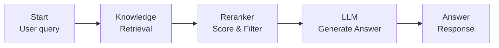
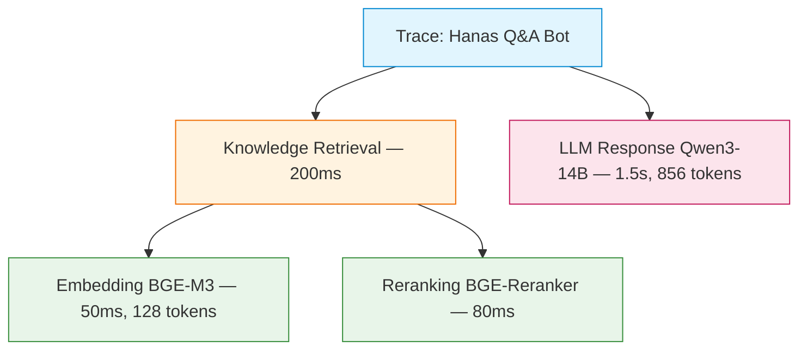

# Dify Workflow Mẫu — RAG Chatbot

## Tổng Quan

Hướng dẫn tạo **RAG Chatbot** trên Dify, sử dụng vLLM models và Knowledge Base để hỏi đáp tài liệu nội bộ. Đây là workflow cơ bản nhất cho hầu hết use cases trong Hanas Platform.

## Kiến Trúc Workflow



## Bước 1: Chuẩn Bị Knowledge Base

### 1.1 Tạo Knowledge Base

1. Dify → **Knowledge → Create Knowledge Base**
2. Đặt tên: `Hanas Internal Docs`
3. Chọn **Embedding Model**: `BAAI/bge-m3` (vLLM)

### 1.2 Upload Tài Liệu

Upload các file PDF/DOCX/TXT chứa tài liệu nội bộ:

| Loại tài liệu | Format | Ghi chú |
|---|---|---|
| Quy trình nội bộ | PDF/DOCX | Chunking tự động |
| FAQ | TXT/MD | 1 Q&A = 1 chunk |
| Hướng dẫn sử dụng | MD | Markdown structure preserved |

### 1.3 Cấu Hình Indexing

```yaml
Embedding Model:    BAAI/bge-m3
Chunk Size:         500 tokens
Chunk Overlap:      50 tokens
Indexing Mode:      High Quality
```

## Bước 2: Tạo Chatflow

### 2.1 Tạo App

1. **Studio → Create App → Chatflow**
2. Đặt tên: `Hanas Q&A Bot`

### 2.2 Thêm Nodes

#### Node 1: Start
- Mặc định, nhận user query

#### Node 2: Knowledge Retrieval
- **Knowledge Base**: `Hanas Internal Docs`
- **Retrieval Mode**: Hybrid Search (N-to-1)
- **Top-K**: 5
- **Score Threshold**: 0.5
- **Reranking**: Enable → `BAAI/bge-reranker-v2-m3`

#### Node 3: LLM
- **Model**: `Qwen/Qwen3-14B-AWQ` (vLLM)
- **System Prompt**:

```text
Bạn là Hanas, trợ lý AI của Katalyst. Trả lời câu hỏi dựa trên context được cung cấp.

Quy tắc:
- Trả lời bằng tiếng Việt, chuyên nghiệp
- Chỉ dựa vào context đã cho, không bịa thông tin
- Nếu không tìm thấy trong context, nói rõ "Tôi không tìm thấy thông tin liên quan"
- Trích dẫn nguồn tài liệu khi có thể

Context:
{{#context#}}
```

- **User Prompt**: `{{#sys.query#}}`
- **Temperature**: 0.3 (accuracy-focused)
- **Max Tokens**: 1024

#### Node 4: Answer
- **Content**: `{{#llm.text#}}`

### 2.3 Kết Nối Nodes

```
Start → Knowledge Retrieval → LLM → Answer
```

## Bước 3: Cấu Hình Chat Settings

### Opening Statement

```text
Xin chào! Tôi là Hanas, trợ lý AI hỗ trợ tra cứu tài liệu nội bộ. 
Hãy đặt câu hỏi để tôi tìm kiếm thông tin cho bạn!
```

### Suggested Questions

```yaml
- "Quy trình đề xuất mua sắm thiết bị"
- "Hướng dẫn cài đặt VPN nội bộ"  
- "Chính sách nghỉ phép năm 2025"
```

### File Upload (Optional)

- Enable file upload nếu cần OCR:
  - Formats: `.jpg`, `.jpeg`, `.png`, `.pdf`
  - Max size: 15 MB

## Bước 4: Test & Publish

### Test Trong Studio

1. Click **Preview** (góc phải trên)
2. Gửi câu hỏi test
3. Kiểm tra:
   - Trả lời đúng nội dung từ tài liệu
   - Không hallucinate (bịa thông tin)
   - Latency chấp nhận được (< 5s)

### Publish

1. Click **Publish**
2. Lấy **API Key** từ **Access API → API Keys**
3. Lấy **Embed Code** nếu muốn nhúng vào website

## Bước 5: Sử Dụng API

### Chat API

```bash
curl -X POST 'http://dify-host/v1/chat-messages' \
  -H 'Authorization: Bearer app-your-api-key' \
  -H 'Content-Type: application/json' \
  -d '{
    "inputs": {},
    "query": "Quy trình đề xuất mua sắm thiết bị như thế nào?",
    "response_mode": "streaming",
    "conversation_id": "",
    "user": "user-001"
  }'
```

### Python SDK

```python
import requests

API_KEY = "app-your-api-key"
DIFY_URL = "http://dify-host"

def ask_hanas(question: str, user_id: str = "default") -> str:
    response = requests.post(
        f"{DIFY_URL}/v1/chat-messages",
        headers={
            "Authorization": f"Bearer {API_KEY}",
            "Content-Type": "application/json"
        },
        json={
            "inputs": {},
            "query": question,
            "response_mode": "blocking",
            "user": user_id
        }
    )
    return response.json()["answer"]

# Sử dụng
answer = ask_hanas("Hướng dẫn cài đặt VPN nội bộ")
print(answer)
```

## Monitoring Trong Langfuse

Sau khi tích hợp Langfuse, mỗi câu hỏi sẽ tạo trace với:



Sử dụng Langfuse để:
- Theo dõi retrieval quality (documents nào được retrieve)
- Đánh giá answer quality
- Tối ưu chunk size và retrieval parameters
