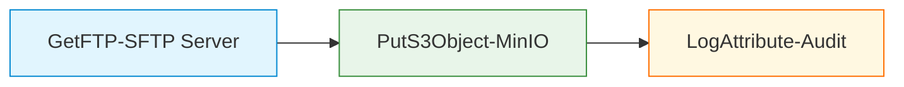
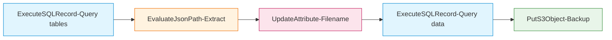
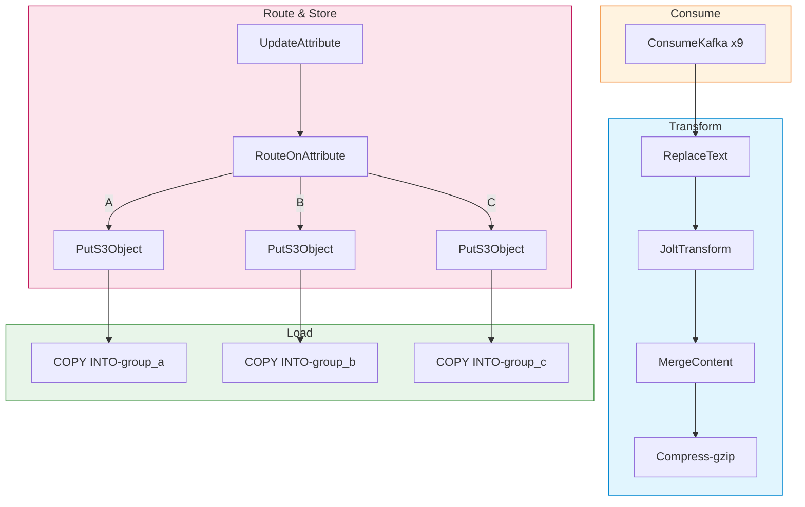
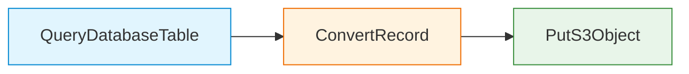
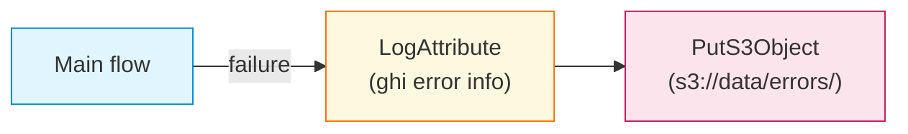

# Code Example: NiFi Flow Mẫu

Các NiFi flow templates thực tế đang chạy trên Hanas Data Platform (NiFi 2.7.2).

---

## 1. Template: FTP → S3 (`get_file_from_ftp_push_s3`)

Thu thập file từ FTP/SFTP server và đẩy lên MinIO.



### Processor Config

| Processor | Property | Value |
|---|---|---|
| **GetFTP** | Hostname | `ap-southeast-1.sftpcloud.io` |
| | Port | `21` |
| | Remote Path | `/demo/` |
| | Polling Interval | `5 sec` |
| | Transfer Mode | `Binary` |
| | Connection Mode | `Passive` |
| | Schedule | `50 sec` (TIMER_DRIVEN) |
| | Execution Node | `PRIMARY` |
| **PutS3Object** | Bucket | `data` |
| | Object Key | `warehouse/upload_file/${filename}` |
| | Endpoint Override URL | `#{p_s3_endpoint}` |
| | AWS Credentials Provider | `AWSCredentialsProviderControllerService` |
| | Auto-terminate failure | `true` |
| **LogAttribute** | Attributes to Log | `.*` |
| | Log Level | `info` |

### Controller Services

```
AWSCredentialsProviderControllerService:
├── Access Key ID: #{p_minio_access_key}
└── Secret Access Key: #{p_minio_secret_key}
```

### Khi Nào Dùng

- Import file từ FTP/SFTP bên ngoài
- Migration dữ liệu từ hệ thống cũ sang MinIO
- Upload CSV, Excel, raw files

---

## 2. Template: Project Template — Backup (`project_template`)

Backup incremental data từ Dremio landing tables sang MinIO/S3.



### Processor Config

| Processor | Property | Value |
|---|---|---|
| **ExecuteSQLRecord** (table list) | SQL Query | *(xem bên dưới)* |
| | Max Rows Per Flow File | `1` |
| | Schedule | `1440 min` (1 lần/ngày) |
| | Execution Node | `PRIMARY` |
| | Retry Count | `10` |
| **EvaluateJsonPath** | `pp_table_name` | `$.table_name` |
| | `pp_sql` | `$.sql_select` |
| | Destination | `flowfile-attribute` |
| **UpdateAttribute** | `filename` | `${now():format('yyyyMMddHHmmssSSS','Asia/Ho_Chi_Minh')}_${pp_table_name}` |
| | `pp_date` | `${now():format('yyyyMMdd','Asia/Ho_Chi_Minh')}` |
| | `pp_datetime` | `${now():format('yyyyMMddHHmmss','Asia/Ho_Chi_Minh')}` |
| **ExecuteSQLRecord** (data) | SQL Query | `${pp_sql}` |
| | Concurrent Tasks | `6` |
| | Schedule | `30 sec` |
| **PutS3Object** | Object Key | `/backup/${filename}` |
| | Bucket | `#{p_s3_bucket}` |
| | Endpoint Override | `#{p_s3_endpoint}` |

### SQL: Query Table List

```sql
SELECT table_name, 
       'SELECT * FROM lakehouse.landing.' || table_name 
       || ' WHERE kafka_ldt >= timestamp ''' || '#{p_backup_start_date}' || '''' 
       AS sql_select  
FROM information_schema."TABLES" 
WHERE table_schema = 'landing';
```

---

## 3. Template: Project Template — Landing (Kafka → Dremio)

Pipeline hoàn chỉnh: ConsumeKafka → Transform → S3 → COPY INTO Dremio.



### Key Processors Config

| Processor | Property | Value |
|---|---|---|
| **ConsumeKafka** (x9) | Kafka Brokers | `#{p_kafka_broker}` |
| | SASL Username | `#{p_kafka_user}` |
| | Schedule | `0 sec` (liên tục) |
| **ReplaceText** | Search Value | `(?s)^\x00.{4}` |
| | Strategy | `Regex Replace` |
| | Concurrent Tasks | `5` |
| **JoltTransformJSON** | Concurrent Tasks | `10` |
| | Back Pressure | 1,000,000 / 5 GB |
| **MergeContent** | Strategy | `Bin-Packing Algorithm` |
| | Correlation | `kafka.topic` |
| | Min/Max Size | 112 MB / 500 MB |
| | Min/Max Entries | 1,000 / 10,000 |
| | Header/Footer/Demarcator | `[` / `]` / `,` |
| | Max Bin Age | `30 min` |
| **CompressContent** | Format | `gzip`, Level `1` |
| **UpdateAttribute** | `pp_tenbang` | *(dynamic mapping — xem chi tiết bên dưới)* |
| | `filename` | `${kafka.topic}_${now():format('yyyyMMddHHmmssSSS','Asia/Ho_Chi_Minh')}_${uuid}` |
| **RouteOnAttribute** | `pp_GROUP_A` | `${pp_kafka_group_route:trim():equals('GROUP_A')}` |
| | `pp_GROUP_B` | `${pp_kafka_group_route:trim():equals('GROUP_B')}` |
| **PutS3Object** (per group) | Object Key | `/warehouse/pre_landing/${pp_date}/${kafka.topic}/${filename}.json.gz` |
| **ExecuteSQLRecord** (COPY INTO) | SQL | `COPY INTO lakehouse.landing.${pp_tenbang} FROM ...` |
| | Schedule | `0 0/5 4-23 ? * *` (CRON) |

### Dynamic Table Name Mapping

```
pp_tenbang = ${kafka.topic:matches('^[A-Z0-9]{3}QuyetDinhXuPhatVPHC$')
    :ifElse(
        "apivphc${kafka.topic:substring(0,3):toLower()}_quyetdinh_xuphat_vphc",
        ${kafka.topic:equals('TopicConsumer_GroupB_V03')
            :ifElse('api_source_group_b_v03',
                ${kafka.topic:equals('TopicConsumer_GroupB')
                    :ifElse('api_source_group_b',
                        ${kafka.topic:equals('TopicConsumer_Reference_01')
                            :ifElse('api_source_reference_01',
                                ${kafka.topic:equals('TopicConsumer_Reference_02')
                                    :ifElse('api_source_reference_02', '')}
                            )}
                    )}
            )}
    )}
```

### Routing Logic

```
pp_kafka_group_route = ${kafka.topic:matches('.*TopicConsumer_GroupB$')
    :ifElse('GROUP_B',
        ${kafka.topic:matches('.*QuyetDinhXuPhatVPHC$')
            :ifElse('GROUP_A','OTHER')}
    )}
```

---

## 4. RDBMS → MinIO (Incremental Load)



| Processor | Property | Value |
|---|---|---|
| **QueryDatabaseTable** | Table Name | `SRC_CUSTOMERS` |
| | Maximum-value Columns | `updated_at` |
| | Max Rows Per Flow File | `50000` |
| | Output Format | Avro |
| **ConvertRecord** | Record Reader | AvroReader |
| | Record Writer | ParquetRecordSetWriter |
| **PutS3Object** | Bucket | `landing` |
| | Object Key | `oracle/src_customers/load_date=${now():format('yyyy-MM-dd')}/part_${UUID()}.parquet` |
| | Endpoint Override URL | `http://minio:9000` |

---

## 5. Error Handling Pattern



Trong template thực tế, tất cả `failure` route về Error Funnel. PutS3Object failure route về `Endtime` (UpdateAttribute ghi `pp_endtime`).

---

## 6. Schedule Patterns

| Pattern | Cron / Timer | Mô tả | Ví Dụ Template |
|---|---|---|---|
| **Liên tục** | `0 sec` (TIMER_DRIVEN) | Real-time consume | ConsumeKafka |
| **Mỗi 50 giây** | `50 sec` (TIMER) | Polling FTP | GetFTP |
| **Mỗi 5 phút** | `0 0/5 4-23 ? * *` (CRON) | Business hours | COPY INTO Dremio |
| **Daily** | `1440 min` (TIMER) | Backup | Backup table list query |

---

## 7. Parameter Contexts

| Parameter | Mô Tả | Ví Dụ |
|-----------|--------|-------|
| `p_s3_endpoint` | MinIO endpoint | `http://minio.storage.svc:9000` |
| `p_s3_bucket` | Bucket name | `data` |
| `p_kafka_broker` | Kafka bootstrap | `hanas-kafka-kafka-bootstrap:9092` |
| `p_kafka_user` | SASL username | `nifi-consumer` |
| `p_backup_start_date` | Ngày bắt đầu backup | `2024-01-01` |

> **Cú pháp**: `#{param}` = Parameter Context (resolve lúc start). `${attr}` = FlowFile attribute (resolve runtime).
