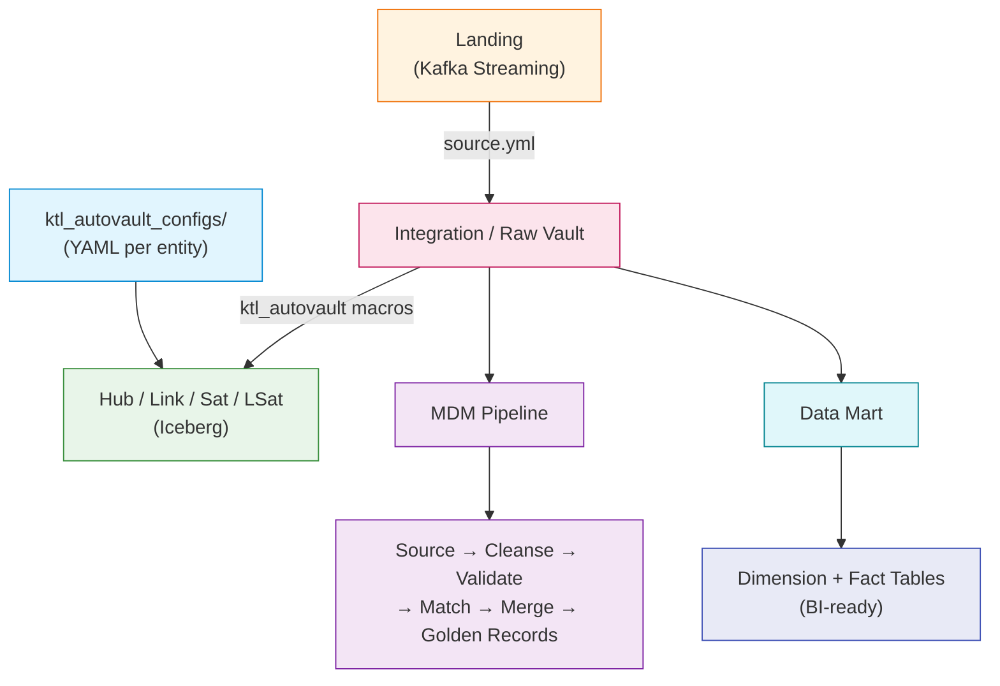
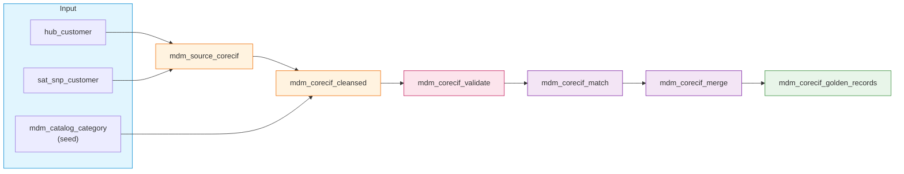

# Integration Guide: dbt + Data Vault

## Tổng Quan

Hướng dẫn sử dụng dbt (`ktl_dbt`) để build Raw Vault, MDM, và Data Mart từ Landing Zone trên Iceberg. Guide này dựa trên codebase thực tế của project `ktl_dbt`.



---

## 1. Cấu Hình dbt Project

### 1.1 profiles.yml

```yaml
# profiles.yml - Connection Spark + Iceberg + Hive Metastore
ktl_dbt:
  target: dev
  outputs:
    dev:
      type: spark
      method: session                              # Spark session mode
      schema: "{{ env_var('SCHEMA_NAME') }}"       # Dynamic schema
      host: local[*]
      port: 7077
      threads: 8
      connect_timeout: 60
      connect_retries: 3
      retry_all: true
      conf:
        "spark.hadoop.hive.metastore.uris": "thrift://<HIVE_METASTORE_HOST>:9083"
        "spark.sql.extensions": "org.apache.iceberg.spark.extensions.IcebergSparkSessionExtensions"
        "spark.sql.catalog.demo": "org.apache.iceberg.spark.SparkCatalog"
        "spark.sql.catalog.demo.type": "hive"
        "spark.sql.catalog.demo.uri": "thrift://<HIVE_METASTORE_HOST>:9083"
        "spark.sql.catalog.demo.io-impl": "org.apache.iceberg.aws.s3.S3FileIO"
        "spark.sql.catalog.demo.s3.endpoint": "http://<MINIO_HOST>:9000"
        "spark.sql.catalog.demo.warehouse": "s3a://data/warehouse/"
        "spark.sql.defaultCatalog": "demo"
        "spark.hadoop.fs.s3a.endpoint": "http://<MINIO_HOST>:9000"
        "spark.hadoop.fs.s3a.access.key": "{{ env_var('AWS_ACCESS_KEY_ID') }}"
        "spark.hadoop.fs.s3a.secret.key": "{{ env_var('AWS_SECRET_ACCESS_KEY') }}"
        "spark.hadoop.fs.s3a.path.style.access": "true"
        "spark.hadoop.fs.s3a.impl": "org.apache.hadoop.fs.s3a.S3AFileSystem"
```

### 1.2 dbt_project.yml

```yaml
name: 'ktl_dbt'
version: '1.0.0'
config-version: 2
profile: 'ktl_dbt'

model-paths: ["models"]
target-path: "/tmp/dbt_target"
log-path: "/tmp/dbt_logs"

vars:
  ref_eod_table: vw_ref_eod           # Bảng tham chiếu thời gian EOD
  dv_hash_method: sha256               # Hash algorithm
  dv_hash_key_dtype: binary            # Hash key data type
  dv_system:                           # System columns cho Data Vault
    columns:
      - target: dv_kaf_ldt             # Thời điểm load từ Kafka
        dtype: timestamp
        source: { name: K_TIMESTAMP, dtype: timestamp }
      - target: dv_cdc_ops            # Loại CDC: R/I/U/D
        dtype: string
        source: { name: op_type, dtype: string }
      - target: dv_src_ldt            # Thời điểm insert từ source
        dtype: timestamp
        source: { name: current_ts, dtype: timestamp }
      - target: dv_ldt                # Thời điểm load vào raw vault
        dtype: timestamp
        source: { name: "current_timestamp()", dtype: timestamp }

models:
  ktl_dbt:
    integration:
      +materialized: table
      +file_format: iceberg
      +schema: integration
      +tblproperties:
        "read.parquet.vectorization.enabled": "true"
        "read.parquet.vectorization.batch-size": "10000"
    mdm:
      +materialized: table
      +file_format: iceberg
      +schema: mdm
    data_mart:
      +materialized: table
      +file_format: iceberg
      +schema: data_mart

seeds:
  ktl_dbt:
    +schema: landing
    +file_format: iceberg
```

### 1.3 Cấu trúc models

```
models/
├── source/
│   └── source.yml                    # Khai báo landing tables
│
├── integration/
│   ├── vw_ref_eod.sql                # View time window cho incremental
│   └── raw_vault/
│       ├── hub/                      # Hub tables
│       │   ├── hub_customer.sql      #   CIF_NO → dv_hkey_hub_customer
│       │   ├── hub_gl.sql            #   BANK_AC → dv_hkey_hub_gl
│       │   ├── hub_branch.sql        #   POS_CD → dv_hkey_hub_branch
│       │   ├── hub_card.sql          #   id → dv_hkey_hub_card
│       │   └── schema.yml
│       ├── lnk/                      # Link tables
│       │   ├── lnk_branch_gl.sql     #   POS_CD + AC_NO
│       │   ├── lnk_branch_parent.sql #   POS_CD + MAIN_POS
│       │   └── schema.yml
│       ├── sat/                      # Satellite tables
│       │   ├── sat_customer.sql      #   Main satellite
│       │   ├── sat_snp_customer.sql  #   Snapshot (latest)
│       │   ├── sat_der_customer.sql  #   Derived (T-1)
│       │   └── ...
│       ├── lsat/                     # Link-Satellite tables
│       │   ├── lsat_branch_gl.sql
│       │   └── ...
│       └── raw_vault_docs.md         # dbt docs definitions
│
├── mdm/                              # MDM Pipeline
│   ├── mdm_source_corecif.sql        #   Source staging
│   ├── mdm_corecif_cleansed.sql      #   Cleansing rules
│   ├── mdm_corecif_validate.sql      #   Validation
│   ├── mdm_corecif_match.sql         #   Matching
│   ├── mdm_corecif_merge.sql         #   Merging
│   ├── mdm_corecif_golden_records.sql #  Golden records
│   └── schema.yml
│
├── data_mart/                        # BI-ready tables
│   ├── dim_time.sql
│   ├── dim_branch.sql
│   ├── dim_pl_item.sql
│   ├── fact_dp_detail.sql            # Huy động chi tiết
│   ├── fact_dp_summary.sql           # Huy động tổng hợp
│   ├── fact_ln_detail.sql            # Cho vay chi tiết
│   ├── fact_ln_summary.sql           # Cho vay tổng hợp
│   ├── fact_pl_detail.sql            # Lợi nhuận chi tiết
│   ├── fact_pl_summary.sql           # Lợi nhuận tổng hợp
│   ├── *_backdate.sql                # Backdate versions
│   └── schema.yml
│
└── mart_refactor/                    # Refactored mart
    ├── intermediate/
    ├── dims/
    └── facts/
```

---

## 2. Source Definitions

### 2.1 source.yml

```yaml
# models/source/source.yml
version: 2

sources:
  - name: landing
    schema: landing
    tables:
      - name: core_cif_streaming          # Khách hàng (Core CIF)
      - name: card_addr_streaming         # Thẻ
      - name: gl_slnv_streaming           # GL sổ lẻ nội vụ
      - name: gl_poc_streaming            # GL POC
      - name: gl_sbv_streaming            # GL SBV
      - name: gl_pos_streaming            # GL POS
      - name: ref_eod                     # Reference EOD dates
      - name: dim_time_streaming          # Dimension thời gian
      - name: gl_poc_backdate             # GL POC backdate
```

### 2.2 EOD Reference View

```sql
-- models/integration/vw_ref_eod.sql
{{ config(materialized='table', file_format='iceberg') }}

SELECT
    cob_date,
    lag(cob_date, 1, {{ ktl_autovault.timestamp('1900-01-01') }})
        OVER (PARTITION BY 1 ORDER BY cob_date ASC) AS last_cob_date,
    optime AS run_time,
    lag(optime, 1, {{ ktl_autovault.timestamp('1900-01-01') }})
        OVER (PARTITION BY 1 ORDER BY cob_date ASC) AS last_run_time
FROM {{ source('landing', 'ref_eod') }}
```

> **Vai trò**: `vw_ref_eod` cung cấp time window (`last_run_time` → `run_time`) cho tất cả incremental models.

---

## 3. Raw Vault Models (AutoVault)

### 3.1 AutoVault Config YAML

Mỗi Data Vault entity được khai báo bằng 1 file YAML trong `ktl_autovault_configs/`:

**Hub** (`ktl_autovault_configs/hub/hub_customer.yml`):

```yaml
source_schema: landing
source_table: core_cif_streaming
target_entity_type: hub
target_schema: integration
target_table: hub_customer
collision_code: demo
columns:
  - target: dv_hkey_hub_customer
    key_type: hash_key_hub         # SHA256 hash key tự sinh
    dtype: string
    source:
      - CIF_NO                    # Business key(s) để hash
  - target: CIF_NO
    key_type: biz_key              # Business key giữ nguyên
    dtype: string
    source:
      name: CIF_NO
      dtype: string
```

**Link** (`ktl_autovault_configs/lnk/lnk_branch_gl.yml`):

```yaml
source_schema: landing
source_table: gl_poc_streaming
target_entity_type: lnk
target_schema: integration
target_table: lnk_branch_gl
collision_code: demo
columns:
  - target: dv_hkey_lnk_branch_gl
    key_type: hash_key_lnk         # Composite hash key
    dtype: string
    source:
      - POS_CD
      - AC_NO
  - target: dv_hkey_hub_branch
    key_type: hash_key_hub
    parent: hub_branch              # FK → Hub Branch
    dtype: string
    source:
      - POS_CD
  - target: dv_hkey_hub_gl
    key_type: hash_key_hub
    parent: hub_gl                  # FK → Hub GL
    dtype: string
    source:
      - AC_NO
```

**Satellite** (`ktl_autovault_configs/sat/sat_customer.yml`):

```yaml
source_schema: landing
source_table: core_cif_streaming
target_entity_type: sat
target_schema: integration
target_table: sat_customer
parent_table: hub_customer          # FK đến Hub
collision_code: demo
columns:
  - target: dv_hkey_sat_customer
    key_type: hash_key_sat
    dtype: string
  - target: dv_hkey_hub_customer
    key_type: hash_key_hub
    dtype: string
    source: [CIF_NO]
  - target: dv_hsh_dif
    dtype: string
    key_type: hash_diff             # Change detection hash
  # Attribute columns:
  - target: CUSTOMER_TYPE
    dtype: string
    source: { name: CUSTOMER_TYPE, dtype: string }
  - target: F_NAME
    dtype: string
    source: { name: F_NAME, dtype: string }
  # ... thêm các attribute columns
```

### 3.2 dbt Model SQL

Mỗi model chỉ cần vài dòng SQL, nhờ `ktl_autovault` macros:

**Hub model** (`models/integration/raw_vault/hub/hub_customer.sql`):

```sql
{{ config(
    materialized='incremental',
    file_format='iceberg',
    incremental_strategy='merge'
) }}




{{ ktl_autovault.hub_transform(model=hub_customer, dv_system=dv_system, include_ghost_record=true) }}
```

**Satellite model** (`models/integration/raw_vault/sat/sat_customer.sql`):

```sql
{{ config(
    materialized='table',
    file_format='iceberg'
) }}




{{ ktl_autovault.sat_transform(model=model, dv_system=dv_system) }}
```

> **Lưu ý**: Hub dùng `incremental + merge` (deduplicate business keys), Satellite dùng `table` (full rebuild).

### 3.3 Satellite Variants

| Type | Prefix | Mô tả | Ví dụ |
|---|---|---|---|
| Main | `sat_` | Full history | `sat_customer` |
| Snapshot | `sat_snp_` | Bản ghi mới nhất | `sat_snp_customer` |
| Derived (T-1) | `sat_der_` | Dữ liệu ngày trước | `sat_der_customer` |

---

## 4. MDM Pipeline

MDM xử lý dữ liệu khách hàng từ Raw Vault thành Golden Records:



### 4.1 Source Staging

```sql
-- models/mdm/mdm_source_corecif.sql
{{ config(
    materialized='incremental',
    file_format='iceberg',
    unique_key='CIF_NO',
    incremental_strategy='merge',
    on_schema_change='sync_all_columns'
) }}


WITH ref_dates AS (
    SELECT run_time, last_run_time
    FROM {{ ref('vw_ref_eod') }}
    
    WHERE cob_date = {{ ktl_autovault.timestamp(var('cob_date')) }}
    
    WHERE cob_date = (SELECT MAX(cob_date) FROM {{ ref('vw_ref_eod') }})
    
)


SELECT
    h.CIF_NO,
    s.CUSTOMER_TYPE, s.F_NAME, s.M_NAME, s.L_NAME, s.CO_NAME,
    s.POS_CD, s.SEX_CD, s.D_O_B, s.PASS_NO, s.MOBILE, s.EMAIL_ID1,
    s.dv_ldt, s.dv_src_ldt
FROM {{ ref('hub_customer') }} h
INNER JOIN {{ ref('sat_snp_customer') }} s
    ON h.dv_hkey_hub_customer = s.dv_hkey_hub_customer

CROSS JOIN ref_dates rd
WHERE s.dv_ldt > rd.last_run_time AND s.dv_ldt <= rd.run_time

```

### 4.2 Cleansing

```sql
-- models/mdm/mdm_corecif_cleansed.sql
{{ config(
    materialized='incremental',
    file_format='iceberg',
    unique_key='CIF_NO',
    incremental_strategy='merge',
    on_schema_change='sync_all_columns'
) }}


-- Filter source records within EOD time window
WITH ref_dates AS ( ... ),
source_filtered AS (
    SELECT s.* FROM {{ ref('mdm_source_corecif') }} s
    JOIN ref_dates rd ON s.dv_ldt > rd.last_run_time AND s.dv_ldt <= rd.run_time
),
cleansed AS (
{{ apply_cleansing_rules(
    source_ref='source_filtered',
    product='CORECIF',
    source_system='SHB'
) }}
)
SELECT * FROM cleansed WHERE CIF_NO <> '0'

-- Full load
WITH cleansed AS (
{{ apply_cleansing_rules(
    source_ref=ref('mdm_source_corecif'),
    product='CORECIF',
    source_system='SHB'
) }}
)
SELECT * FROM cleansed WHERE CIF_NO <> '0'

```

---

## 5. Data Mart Models

### 5.1 Dimensions

```sql
-- models/data_mart/dim_branch.sql
{{ config(materialized='table', file_format='iceberg') }}

-- Join Hub Branch + Satellite Branch + Link Branch Parent
-- để tạo dimension với parent-child hierarchy
SELECT
    b.POS_CD AS BRANCH_CODE,
    bs.BRANCH_NAME,
    p.MAIN_POS AS PARENT_CODE,
    ps.BRANCH_NAME AS PARENT_NAME,
    bs.KV_NAME,
    bs.STAFF_NUM AS NBR_STAFF,
    ...
FROM {{ ref('hub_branch') }} b
INNER JOIN {{ ref('sat_snp_branch') }} bs ON b.dv_hkey_hub_branch = bs.dv_hkey_hub_branch
LEFT JOIN {{ ref('lnk_branch_parent') }} lnk ON b.dv_hkey_hub_branch = lnk.dv_hkey_hub_branch
LEFT JOIN {{ ref('hub_branch') }} p ON lnk.dv_hkey_hub_branch_parent = p.dv_hkey_hub_branch
...
```

### 5.2 Facts

```sql
-- models/data_mart/fact_dp_detail.sql (Huy động chi tiết)
{{ config(materialized='table', file_format='iceberg') }}

-- Join GL data + Branch dimension + EOD reference
SELECT
    d.COB_DATE,
    b.BRANCH_CODE,
    b.D_BRANCH_ID,
    g.CUSTOMER_TYPE,
    g.ACCOUNT_TYPE,
    g.LCY_CURR_BALANCE,
    g.FCY_CURR_BALANCE
FROM integration_gl_data g
INNER JOIN {{ ref('dim_branch') }} b ON g.POS_CD = b.BRANCH_CODE
INNER JOIN {{ ref('dim_time') }} d ON g.EOD_DATE = d.COB_DATE
```

---

## 6. Chạy dbt

### 6.1 Sử dụng Python Runners

```bash
# Chạy tất cả models
python dbt_runner.py --use-subprocess --dbt-command ktl_dbt \
  run --target dev

# Chạy theo layer
python dbt_runner.py --use-subprocess --dbt-command ktl_dbt \
  run --target dev --select integration.*        # Raw Vault

python dbt_runner.py --use-subprocess --dbt-command ktl_dbt \
  run --target dev --select mdm.*                # MDM Pipeline

python dbt_runner.py --use-subprocess --dbt-command ktl_dbt \
  run --target dev --select data_mart.*          # Data Mart

# Chạy với cob_date cụ thể
python dbt_runner.py --use-subprocess --dbt-command ktl_dbt \
  run --target dev --vars '{"cob_date": "2025-12-30"}'

# Compile để xem SQL
python dbt_compile.py --select hub_customer

# Load seed data
python dbt_seed.py
```

### 6.2 Full Pipeline với Logging & Artifacts

```bash
python dbt_runner.py \
  --use-subprocess \
  --dbt-command ktl_dbt \
  --log-to-lakehouse \
  --job-log-table LakeHouse.etladmin.job_run_logs \
  --sql-log-table LakeHouse.etladmin.job_sql_logs \
  --upload-artifacts \
  --s3-bucket data \
  --s3-prefix dbt/artifacts/$(date +%Y-%m-%d) \
  --s3-endpoint-url http://minio:9000 \
  run --target dev
```

### 6.3 Deploy trên Kubernetes

```bash
# SparkOperator sẽ chạy flow:
# 1. git-sync init container → pull dbt project
# 2. dbt deps → install packages
# 3. dbt run → execute models
# 4. dbt docs → generate catalog
# 5. upload artifacts → S3/MinIO
```

---

## 7. Testing & Documentation

### 7.1 schema.yml

```yaml
# models/data_mart/schema.yml
version: 2

models:
  - name: dim_time
    description: "Chiều thời gian: ngày/tuần/tháng/quý/năm"
    columns:
      - name: COB_DATE
        description: "{{ doc('cob_date') }}"
      - name: DAY_KEY
        description: "{{ doc('day_key') }}"

  - name: fact_dp_detail
    description: "Huy động chi tiết"
    columns:
      - name: BRANCH_CODE
        description: "{{ doc('branch_code') }}"
      - name: LCY_CURR_BALANCE
        description: "{{ doc('lcy_curr_balance') }}"
```

### 7.2 dbt Docs (raw_vault_docs.md)

```markdown

Thông tin CIF_NO của khách hàng được lưu trữ tập trung tại bảng hub_customer.



Hash key của hub customer được sinh ra bởi CIF_NO bằng hàm SHA256.



Loại CDC: "R"="read", "I"="insert", "U"="update", "D"="delete".

```

---

## 8. Best Practices

| Practice | Mô tả |
|---|---|
| **AutoVault YAML** | Dùng YAML config thay vì viết SQL thủ công cho Data Vault entities |
| **Hub = incremental merge** | Deduplicate business keys, chỉ insert mới |
| **Sat = table rebuild** | Full rebuild đảm bảo tính nhất quán |
| **MDM = incremental merge** | Merge by `unique_key` (CIF_NO) với `on_schema_change='sync_all_columns'` |
| **ref_eod time window** | Dùng `vw_ref_eod` thay vì hardcode dates cho incremental |
| **Ghost records** | Luôn `include_ghost_record=true` khi tạo Hub |
| **Naming convention** | `hub_`, `sat_`, `sat_snp_`, `sat_der_`, `lnk_`, `lsat_` |
| **Dùng `ref()` / `source()`** | Không hardcode table names, dbt quản lý dependency |
| **Schema override** | `generate_schema_name` macro đặt schema trực tiếp |
| **Lakehouse logging** | Bật `--log-to-lakehouse` cho audit và monitoring |
| **Artifact upload** | Upload manifest/run_results/catalog lên S3 sau mỗi run |
