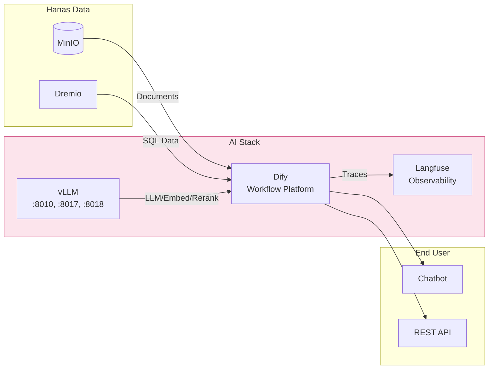

# Tích Hợp Dify + vLLM + Langfuse

## Tổng Quan

Hướng dẫn này mô tả cách tích hợp 3 thành phần AI Service với nhau và với Hanas Data Platform, tạo thành **AI stack hoàn chỉnh** từ inference → workflow → observability.



## Prerequisites

| Service | Status | Kiểm tra |
|---|---|---|
| **vLLM** | Running (3 services) | `curl http://vllm-host:8010/v1/models` |
| **Dify** | Running | `curl http://dify-host/v1/health` |
| **Langfuse** | Running | `curl http://langfuse-host:3000/api/public/health` |

## Bước 1: Kết Nối vLLM → Dify

### 1.1 Thêm LLM Model Provider

1. Dify Console → **Settings → Model Providers**
2. Click **Add Model Provider → OpenAI-API-compatible**
3. Điền thông tin:

```
Provider Name:  vllm-llm
Model Name:     Qwen/Qwen3-14B-AWQ
API Base URL:   http://<vllm-host>:8010/v1
API Key:        token-abc123
Model Type:     LLM
Context Size:   32768
```

### 1.2 Thêm Embedding Model Provider

```
Provider Name:  vllm-embeddings
Model Name:     BAAI/bge-m3
API Base URL:   http://<vllm-host>:8017/v1
API Key:        token-abc123
Model Type:     Text Embedding
Max Tokens:     1024
```

### 1.3 Thêm Reranker Model Provider

```
Provider Name:  vllm-reranker
Model Name:     BAAI/bge-reranker-v2-m3
API Base URL:   http://<vllm-host>:8018/v1
API Key:        token-abc123
Model Type:     Rerank
Max Tokens:     1024
```

### 1.4 Xác Nhận

Test từng model bằng cách tạo Chatbot đơn giản và gửi tin nhắn.

## Bước 2: Kết Nối Dify → Langfuse

### 2.1 Tạo Project Trong Langfuse

1. Truy cập Langfuse Dashboard → **New Project**
2. Đặt tên: `hanas-ai-production`
3. **API Keys → Create** → Ghi lại Public Key và Secret Key

### 2.2 Cấu Hình Trong Dify

Thêm vào `.env` của Dify:

```bash
LANGFUSE_PUBLIC_KEY=pk-lf-xxxxxxxxxxxxxxxx
LANGFUSE_SECRET_KEY=sk-lf-xxxxxxxxxxxxxxxx
LANGFUSE_HOST=http://langfuse-host:3000
```

Restart Dify:

```bash
docker compose restart api worker
```

### 2.3 Kích Hoạt

1. Dify Console → **Settings → Monitoring → Langfuse**
2. Verify kết nối → **Enable**

### 2.4 Xác Nhận

1. Gửi tin nhắn trong bất kỳ Dify app
2. Mở Langfuse Dashboard → **Traces**
3. Trace mới phải xuất hiện trong vài giây

## Bước 3: Tích Hợp Với Hanas Data

### 3.1 Knowledge Base Từ MinIO Documents

1. Upload documents từ MinIO vào Dify Knowledge Base
2. Hoặc cấu hình Dify sử dụng **MinIO** làm object storage:

```bash
# Dify .env
STORAGE_TYPE=s3
S3_ENDPOINT=http://minio.hanas:9000
S3_BUCKET_NAME=dify-storage
S3_ACCESS_KEY=minio-access-key
S3_SECRET_KEY=minio-secret-key
```

### 3.2 Dremio SQL Data → AI Analytics

Sử dụng **HTTP Request node** trong Dify workflow để query Dremio:

```json
{
  "url": "http://dremio-host:9047/api/v3/sql",
  "method": "POST",
  "headers": {
    "Authorization": "Bearer <dremio-token>",
    "Content-Type": "application/json"
  },
  "body": {
    "sql": "SELECT * FROM lakehouse.warehouse.data_mart.dim_customer LIMIT 10"
  }
}
```

## Bước 4: End-to-End Test

### Test RAG Pipeline

```bash
# 1. Upload tài liệu vào Knowledge Base (qua Dify UI)

# 2. Tạo Chatbot với Knowledge Base
#    - Model: Qwen/Qwen3-14B-AWQ
#    - Embedding: BAAI/bge-m3
#    - Reranker: BAAI/bge-reranker-v2-m3
#    - Retrieval: Hybrid Search

# 3. Test query
curl -X POST 'http://dify-host/v1/chat-messages' \
  -H 'Authorization: Bearer app-xxx' \
  -H 'Content-Type: application/json' \
  -d '{
    "query": "Hướng dẫn cấu hình Airflow DAG",
    "response_mode": "blocking",
    "user": "test-user"
  }'

# 4. Kiểm tra trace trong Langfuse
#    → Trace phải hiển thị: Embedding → Retrieval → Reranking → LLM Generation
```

### Test Tool Calling (Agent)

```bash
# Test Agent với GLPI integration
curl -X POST 'http://dify-host/v1/chat-messages' \
  -H 'Authorization: Bearer app-xxx' \
  -H 'Content-Type: application/json' \
  -d '{
    "query": "Liệt kê các phiếu đề xuất đang mở trong hệ thống",
    "response_mode": "blocking",
    "user": "test-user"
  }'
```

## Kiểm Tra Sức Khỏe Toàn Bộ Stack

```bash
#!/bin/bash
echo "=== AI Stack Health Check ==="

# vLLM Services
echo "--- vLLM ---"
echo "LLM:       $(curl -sf http://vllm-host:8010/v1/models | jq -r '.data[0].id // "DOWN"')"
echo "Embedding: $(curl -sf http://vllm-host:8017/v1/models | jq -r '.data[0].id // "DOWN"')"
echo "Reranker:  $(curl -sf http://vllm-host:8018/v1/models | jq -r '.data[0].id // "DOWN"')"

# Dify
echo "--- Dify ---"
echo "API:       $(curl -sf http://dify-host/v1/health | jq -r '.status // "DOWN"')"

# Langfuse
echo "--- Langfuse ---"
echo "Server:    $(curl -sf http://langfuse-host:3000/api/public/health | jq -r '.status // "DOWN"')"

# GPU
echo "--- GPU ---"
nvidia-smi --query-gpu=name,memory.used,memory.total --format=csv,noheader 2>/dev/null || echo "No GPU access"

echo "=== Done ==="
```

## Troubleshooting

| Vấn đề | Nguyên nhân | Giải pháp |
|---|---|---|
| Dify không thấy vLLM model | Sai API Base URL | Kiểm tra URL và port |
| Embedding chậm/timeout | vLLM embedding service overloaded | Tăng `MAX_NUM_SEQS` |
| Langfuse không nhận traces | Sai API keys hoặc host | Verify keys trong Langfuse → Project Settings |
| Knowledge Base retrieval kém | Chunk size không phù hợp | Thử chunk_size 300-800, bật reranking |
| Agent không gọi tools | Model không hỗ trợ tool calling | Verify Qwen3-14B + Hermes tool parser |
