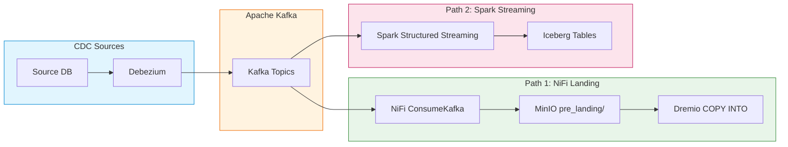
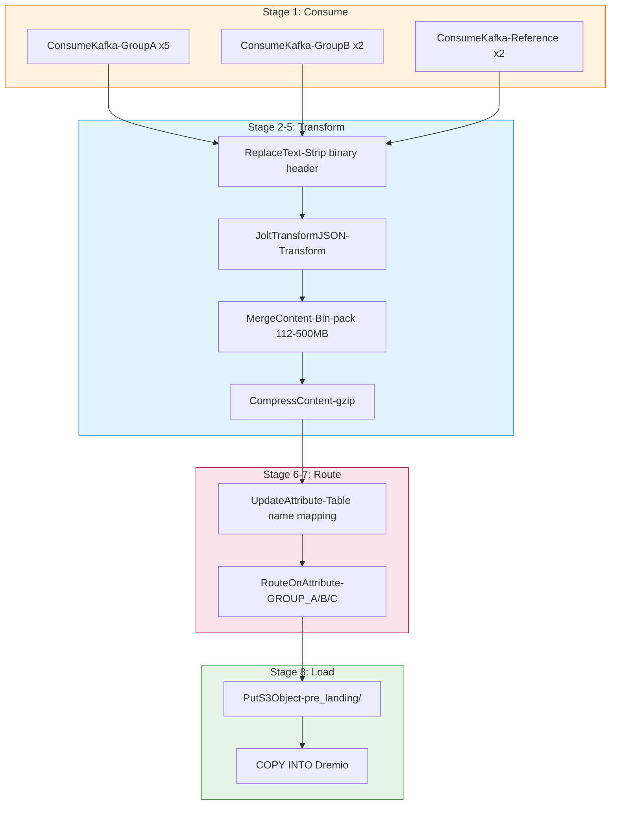

# Integration Guide: Kafka Streaming Flow

## Tổng Quan

Hướng dẫn xây dựng luồng streaming sử dụng Kafka trong Hanas Platform. Bao gồm 2 phương pháp:
1. **NiFi Landing Pipeline** — ConsumeKafka → Transform → S3 → COPY INTO Dremio (đang chạy production)
2. **Spark Structured Streaming** — Kafka → Spark → Iceberg (advanced)



---

## 1. NiFi Landing Pipeline (Production Template)

Pipeline chính trên Hanas Platform, lấy trực tiếp từ `project_template.json`. Thu thập dữ liệu từ Kafka topics, transform, và load vào Dremio Iceberg tables.

> Xem chi tiết đầy đủ: [NiFi User Guide — Template 2 (Landing)](../../01-ingestion/apache-nifi/user-guide.md#42-landing-process-group)

### Kiến Trúc 8 Stages



### 1.1 Stage 1: ConsumeKafka — Thu Thập Dữ Liệu

9 Kafka consumers chia thành 3 nhóm, chạy liên tục:

```
Kafka Brokers: #{p_kafka_broker}
SASL Username: #{p_kafka_user}
Schedule: 0 sec (TIMER_DRIVEN — liên tục)
Retry Count: 10
```

| Consumer Group | Consumers | Execution |
|---------------|-----------|-----------|
| Group A | `TopicConsumer_GroupA_V03`, `_X05`, `_C06`, `_C08`, `_A08` | ALL nodes |
| Group B | `TopicConsumer_GroupB`, `_GroupB_V03` | ALL nodes |
| Reference | `TopicConsumer_Reference_01`, `_02` | ALL / PRIMARY |

### 1.2 Stage 2: ReplaceText — Binary Header Cleanup

Xóa 5-byte binary schema prefix từ Confluent Schema Registry:

```properties
Search Value: (?s)^\x00.{4}
Replacement Strategy: Regex Replace
Replacement Value: (empty)
Evaluation Mode: Entire text
Concurrent Tasks: 5
```

### 1.3 Stage 3: JoltTransformJSON

Transform JSON structure. **Back pressure đặc biệt**: 1,000,000 objects / 5 GB (vì transform tốn thời gian).

### 1.4 Stage 4: MergeContent — Bin-Packing

Gom hàng nghìn Kafka messages nhỏ thành file lớn 112–500 MB:

| Cấu Hình | Giá Trị |
|----------|---------|
| Merge Strategy | Bin-Packing Algorithm |
| Correlation Attribute | `kafka.topic` |
| Min / Max Group Size | 112 MB / 500 MB |
| Min / Max Entries | 1,000 / 10,000 |
| Max Bin Age | 30 min |
| Header / Footer / Demarcator | `[` / `]` / `,` |

> **Output**: JSON array `[{record1},{record2},...]` — tối ưu cho `COPY INTO` Dremio.

### 1.5 Stage 5: CompressContent

Nén gzip level 1 (fastest) trước khi ghi S3.

### 1.6 Stage 6: UpdateAttribute — Routing Logic

**Dynamic table name mapping** (NiFi Expression Language):

```
pp_tenbang = ${kafka.topic:matches('^[A-Z0-9]{3}QuyetDinhXuPhatVPHC$')
    :ifElse(
        "apivphc${kafka.topic:substring(0,3):toLower()}_quyetdinh_xuphat_vphc",
        ${kafka.topic:equals('TopicConsumer_GroupB_V03')
            :ifElse('api_source_group_b_v03', ...)}
    )}
```

**Routing attribute:**

```
pp_kafka_group_route = ${kafka.topic:matches('.*TopicConsumer_GroupB$')
    :ifElse('GROUP_B',
        ${kafka.topic:matches('.*QuyetDinhXuPhatVPHC$')
            :ifElse('GROUP_A','OTHER')}
    )}
```

### 1.7 Stage 7: RouteOnAttribute

| Route | Expression | Destination |
|-------|-----------|-------------|
| `pp_GROUP_A` | `${pp_kafka_group_route:trim():equals('GROUP_A')}` | `putS3_group_a` |
| `pp_GROUP_B` | `${pp_kafka_group_route:trim():equals('GROUP_B')}` | `putS3_group_b` |
| `pp_GROUP_C` | `${pp_kafka_group_route:trim():equals('OTHER')}` | `putS3_group_c` |

### 1.8 Stage 8: PutS3Object → COPY INTO Dremio

**PutS3Object** — Lưu file lên MinIO:

```properties
Object Key: /warehouse/pre_landing/${pp_date}/${kafka.topic}/${filename}.json.gz
Bucket: #{p_s3_bucket}
Endpoint Override URL: #{p_s3_endpoint}
```

**ExecuteSQLRecord — COPY INTO Dremio** (CRON `0 0/5 4-23 ? * *`):

```sql
COPY INTO lakehouse.landing.${pp_tenbang} 
FROM '@Minio/#{p_s3_bucket}/warehouse/pre_landing/${pp_date}/${kafka.topic}/${filename}.json.gz'
FILE_FORMAT 'json'
```

### 1.9 Đường Dẫn Dữ Liệu Trên MinIO

```
s3://data/warehouse/pre_landing/
└── {yyyyMMdd}/                      # pp_date
    └── {kafka.topic}/               # Topic name
        └── {topic}_{timestamp}_{uuid}.json.gz
```

---

## 2. CDC với Kafka Connect (Debezium)

### 2.1 Debezium Oracle Connector

```json
{
  "name": "oracle-cdc-connector",
  "config": {
    "connector.class": "io.debezium.connector.oracle.OracleConnector",
    "database.hostname": "oracle-host",
    "database.port": "1521",
    "database.user": "cdc_user",
    "database.password": "********",
    "database.dbname": "ORCL",
    "database.server.name": "oracle-prod",
    "schema.include.list": "ETL_SCHEMA",
    "table.include.list": "ETL_SCHEMA.SRC_CUSTOMERS,ETL_SCHEMA.SRC_ACCOUNTS",
    "database.history.kafka.bootstrap.servers": "kafka:9092",
    "database.history.kafka.topic": "schema-changes",
    "transforms": "unwrap",
    "transforms.unwrap.type": "io.debezium.transforms.ExtractNewRecordState",
    "transforms.unwrap.drop.tombstones": "true",
    "key.converter": "org.apache.kafka.connect.json.JsonConverter",
    "value.converter": "org.apache.kafka.connect.json.JsonConverter"
  }
}
```

### 2.2 Kafka Topics

```
Topics:
├── oracle-prod.ETL_SCHEMA.SRC_CUSTOMERS      # CDC events
├── oracle-prod.ETL_SCHEMA.SRC_ACCOUNTS
├── oracle-prod.ETL_SCHEMA.SRC_TRANSACTIONS
├── hanas.streaming.errors                      # Dead letter queue
└── schema-changes                              # Schema evolution
```

---

## 3. Spark Structured Streaming → Iceberg (Advanced)

### 3.1 Consumer: Kafka → Iceberg Hub

```python
# streaming_hub_customer.py
import os

from pyspark.sql import SparkSession
from pyspark.sql.functions import *
from pyspark.sql.types import *

spark = (SparkSession.builder
    .appName("streaming-hub-customer")
    .config("spark.sql.catalog.hanas", "org.apache.iceberg.spark.SparkCatalog")
    .config("spark.sql.catalog.hanas.type", "hadoop")
    .config("spark.sql.catalog.hanas.warehouse", "s3a://warehouse/")
    .config("spark.hadoop.fs.s3a.endpoint", "http://minio:9000")
    .config("spark.hadoop.fs.s3a.access.key", os.environ["MINIO_ACCESS_KEY"])
    .config("spark.hadoop.fs.s3a.secret.key", os.environ["MINIO_SECRET_KEY"])
    .config("spark.hadoop.fs.s3a.path.style.access", "true")
    .config("spark.sql.streaming.checkpointLocation", "s3a://warehouse/checkpoints/")
    .getOrCreate())

# Schema cho Debezium CDC event
cdc_schema = StructType([
    StructField("customer_id", StringType()),
    StructField("full_name", StringType()),
    StructField("email", StringType()),
    StructField("phone", StringType()),
    StructField("city", StringType()),
    StructField("segment", StringType()),
    StructField("__op", StringType()),        # c=create, u=update, d=delete
    StructField("__source_ts_ms", LongType()),
])

# Đọc từ Kafka
df_stream = (spark.readStream
    .format("kafka")
    .option("kafka.bootstrap.servers", "kafka:9092")
    .option("subscribe", "oracle-prod.ETL_SCHEMA.SRC_CUSTOMERS")
    .option("startingOffsets", "latest")
    .option("maxOffsetsPerTrigger", "10000")
    .load()
    .select(
        from_json(col("value").cast("string"), cdc_schema).alias("data"),
        col("timestamp").alias("kafka_ts")
    )
    .select("data.*", "kafka_ts"))

# Transform → Hub
df_hub = (df_stream
    .filter(col("__op").isin("c", "u"))
    .select("customer_id")
    .withColumn("hub_customer_hk",
        md5(concat_ws("||", lit("CUSTOMER"), "customer_id")))
    .withColumn("load_dts", current_timestamp())
    .withColumn("record_source", lit("CDC.ORACLE.SRC_CUSTOMERS"))
    .dropDuplicates(["hub_customer_hk"]))

# Ghi vào Iceberg (micro-batch mỗi 30s)
query = (df_hub.writeStream
    .format("iceberg")
    .outputMode("append")
    .option("checkpointLocation", "s3a://warehouse/checkpoints/hub_customer/")
    .trigger(processingTime="30 seconds")
    .toTable("hanas.raw_vault.hub_customer"))

query.awaitTermination()
```

### 3.2 Consumer: Kafka → Iceberg Satellite (với change detection)

```python
# streaming_sat_customer.py
df_sat = (df_stream
    .filter(col("__op").isin("c", "u"))
    .withColumn("hub_customer_hk",
        md5(concat_ws("||", lit("CUSTOMER"), "customer_id")))
    .withColumn("hash_diff",
        md5(concat_ws("||", "full_name", "email", "phone", "city", "segment")))
    .withColumn("load_dts", current_timestamp())
    .withColumn("load_end_dts", lit(None).cast("timestamp"))
    .withColumn("record_source", lit("CDC.ORACLE.SRC_CUSTOMERS"))
    .select(
        "hub_customer_hk", "load_dts", "load_end_dts",
        "record_source", "hash_diff",
        "full_name", "email", "phone", "city", "segment"
    ))

# Custom merge logic: chỉ ghi nếu hash thay đổi
def process_batch(batch_df, batch_id):
    if batch_df.count() == 0:
        return
    batch_df.createOrReplaceTempView(f"updates_{batch_id}")
    spark.sql(f"""
        MERGE INTO hanas.raw_vault.sat_customer_details AS target
        USING updates_{batch_id} AS source
        ON target.hub_customer_hk = source.hub_customer_hk
           AND target.load_end_dts IS NULL
           AND target.hash_diff = source.hash_diff
        WHEN NOT MATCHED THEN INSERT *
    """)

query = (df_sat.writeStream
    .foreachBatch(process_batch)
    .option("checkpointLocation", "s3a://warehouse/checkpoints/sat_customer/")
    .trigger(processingTime="1 minute")
    .start())

query.awaitTermination()
```

---

## 4. So Sánh: NiFi Landing vs Spark Streaming

| Tiêu Chí | NiFi Landing Pipeline | Spark Structured Streaming |
|----------|----------------------|---------------------------|
| **Complexity** | Visual, low-code | Code-based (PySpark) |
| **Latency** | 5 phút (CRON COPY INTO) | 30 giây (micro-batch) |
| **Transform** | JoltTransform, ReplaceText | Full Spark SQL/DataFrame |
| **Output** | Files trên S3 → COPY INTO Dremio | Trực tiếp vào Iceberg tables |
| **Error Handling** | FlowFile retry, Provenance | Checkpointing, DLQ |
| **Use Case** | Landing data, file-based ETL | Complex transforms, Data Vault |
| **Monitoring** | NiFi UI, Bulletin Board | Spark UI, Kafka lag |
| **Production** | Đang chạy (project_template) | Advanced use cases |

> **Khuyến nghị**: Dùng **NiFi Landing Pipeline** cho ingestion chuẩn. Dùng **Spark Streaming** khi cần transform phức tạp hoặc latency < 1 phút.

---

## 5. Error Handling

### 5.1 NiFi: Retry + Funnel

Trong template thực tế, tất cả `failure` relationships được route về Error Funnel:

```
ReplaceText ── failure ──▶ Funnel (Error)
JoltTransformJSON ── failure ──▶ Funnel (Error)
MergeContent ── failure ──▶ Funnel (Error)
PutS3Object ── failure ──▶ Endtime (log thời gian lỗi)
```

### 5.2 Spark: Dead Letter Queue

```python
def process_with_dlq(batch_df, batch_id):
    try:
        process_batch(batch_df, batch_id)
    except Exception as e:
        error_df = batch_df.withColumn("error", lit(str(e)))
        (error_df.selectExpr("CAST(key AS STRING)", "to_json(struct(*)) AS value")
            .write.format("kafka")
            .option("kafka.bootstrap.servers", "kafka:9092")
            .option("topic", "hanas.streaming.errors")
            .save())
```

---

## 6. Monitoring

| Metric | NiFi | Spark |
|--------|------|-------|
| **Throughput** | FlowFiles In/Out trên UI | Input/Processing Rate |
| **Lag** | Queue size trên connections | `kafka-consumer-groups.sh --describe` |
| **Errors** | Bulletin Board (ERROR) | Spark UI + exception logs |
| **Health** | `/nifi-api/system-diagnostics` | Spark REST API |
| **Alert** | Queue > 80% back pressure | Kafka lag > 10,000 |

---

## 7. Best Practices

| Practice | Mô tả |
|---|---|
| **NiFi: MergeContent trước PutS3** | Gom messages nhỏ thành file lớn (112–500 MB) |
| **NiFi: CompressContent gzip** | Giảm 70–90% dung lượng trước khi ghi S3 |
| **NiFi: RouteOnAttribute** | Tách luồng theo topic group để parallel load |
| **Spark: maxOffsetsPerTrigger** | Giới hạn batch size, tránh OOM |
| **Spark: Checkpoint trên MinIO** | Persist offset, survive restart |
| **Spark: MERGE cho Satellite** | Change detection bằng hash_diff |
| **Chung: Dead Letter Queue** | Không mất event khi lỗi |
| **Chung: Monitor Kafka lag** | Alert khi lag tăng bất thường |
