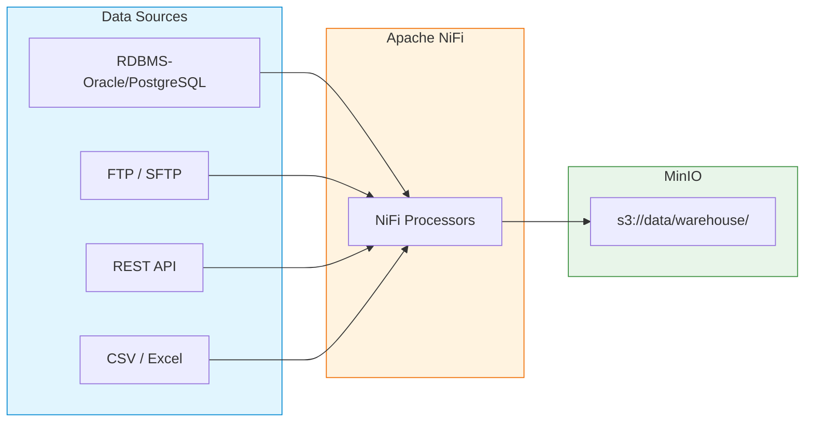
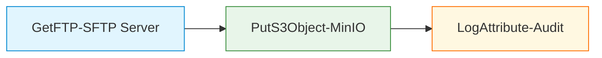
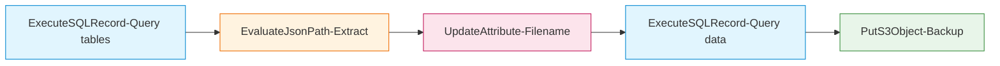

# Integration Guide: NiFi → MinIO

## Tổng Quan

Hướng dẫn cấu hình Apache NiFi để thu thập dữ liệu từ các nguồn khác nhau và ghi vào MinIO (Landing Zone). Bao gồm 2 template thực tế đang chạy trên Hanas Platform.



---

## 1. Cấu Hình Controller Services

### 1.1 S3 Credentials (cho MinIO)

```properties
# Controller Service: AWSCredentialsProviderControllerService
Service Name: MinIO-Credentials
Access Key ID: #{p_minio_access_key}
Secret Access Key: #{p_minio_secret_key}
```

### 1.2 JDBC Connection Pool (cho Dremio)

```properties
# Controller Service: DBCPConnectionPool
Service Name: DremioJDBC
Database Connection URL: jdbc:dremio:direct=dremio-master:31010
Database Driver Class Name: com.dremio.jdbc.Driver
Database Driver Location(s): /opt/nifi/nifi-current/drivers/dremio-jdbc-driver.jar
Database User: ${dremio.username}
Max Wait Time: 500 millis
Max Total Connections: 20
```

### 1.3 JDBC Connection Pool (cho Oracle)

```properties
# Controller Service: DBCPConnectionPool
Service Name: Oracle-JDBC-Pool
Database Connection URL: jdbc:oracle:thin:@//oracle-host:1521/ORCL
Database Driver Class Name: oracle.jdbc.OracleDriver
Database Driver Location(s): /opt/nifi/drivers/ojdbc11.jar
Database User: etl_user
Password: ********
Max Wait Time: 30 sec
Max Total Connections: 10
Validation Query: SELECT 1 FROM DUAL
```

---

## 2. Template Thực Tế: FTP → S3 (`get_file_from_ftp_push_s3`)

Template đầu tiên trên Hanas Platform. Thu thập file từ FTP server và đẩy lên MinIO.

> Xem chi tiết đầy đủ: [NiFi User Guide — Template 1](../01-ingestion/apache-nifi/user-guide.md#3-template-1--ftp--s3-get_file_from_ftp_push_s3)

### Flow Diagram



### Cấu Hình Từ Template

#### GetFTP

| Property | Giá Trị | Ghi Chú |
|----------|---------|---------|
| Hostname | `ap-southeast-1.sftpcloud.io` | FTP/SFTP server |
| Port | `21` | — |
| Remote Path | `/demo/` | Thư mục nguồn |
| Polling Interval | `5 sec` | Tần suất kiểm tra |
| Transfer Mode | `Binary` | Giữ nguyên format |
| Connection Mode | `Passive` | Phù hợp firewall |
| Scheduling | `50 sec`, TIMER_DRIVEN | — |
| Execution Node | `PRIMARY` | Chỉ primary node |

#### PutS3Object

| Property | Giá Trị | Ghi Chú |
|----------|---------|---------|
| Bucket | `data` | MinIO bucket |
| Object Key | `warehouse/upload_file/${filename}` | Đường dẫn trên S3 |
| Endpoint Override URL | `#{p_s3_endpoint}` | MinIO endpoint |
| AWS Credentials Provider | `MinIO-Credentials` | Controller Service |
| Auto-terminate | `failure` | — |

#### LogAttribute

Ghi log toàn bộ FlowFile attributes cho audit trail. `Attributes to Log: .*` (regex).

### Khi Nào Dùng

- Thu thập file từ FTP/SFTP server bên ngoài
- Import CSV, Excel, hoặc raw files vào MinIO
- Migration dữ liệu từ hệ thống cũ

---

## 3. Template Thực Tế: Backup Dremio → S3 (`project_template`)

Backup toàn bộ dữ liệu từ Dremio landing tables sang MinIO/S3.

> Xem chi tiết đầy đủ: [NiFi User Guide — Template 2 (Backup)](../01-ingestion/apache-nifi/user-guide.md#41-backup-process-group)

### Flow Diagram



### Luồng Chi Tiết

**Bước 1 — Query danh sách bảng (Schedule: 1440 min = 1 lần/ngày):**

```sql
SELECT table_name, 
       'SELECT * FROM lakehouse.landing.' || table_name 
       || ' WHERE kafka_ldt >= timestamp ''' || '#{p_backup_start_date}' || '''' 
       AS sql_select  
FROM information_schema."TABLES" 
WHERE table_schema = 'landing';
```

**Bước 2 — Extract fields:**

| Attribute | JSONPath |
|-----------|---------|
| `pp_table_name` | `$.table_name` |
| `pp_sql` | `$.sql_select` |

**Bước 3 — Generate filename (NiFi Expression Language):**

```
filename = ${now():format('yyyyMMddHHmmssSSS','Asia/Ho_Chi_Minh')}_${pp_table_name}
pp_date  = ${now():format('yyyyMMdd','Asia/Ho_Chi_Minh')}
```

**Bước 4 — Query data:** SQL `${pp_sql}`, Concurrent Tasks = 6 (parallel)

**Bước 5 — PutS3Object:**

| Property | Giá Trị |
|----------|---------|
| Object Key | `/backup/${filename}` |
| Bucket | `#{p_s3_bucket}` |
| Back Pressure | 10,000 objects / **10 GB** |

### Khi Nào Dùng

- Backup incremental data từ Dremio landing zone
- Sao lưu định kỳ trước maintenance
- Disaster recovery — khôi phục dữ liệu khi cần

---

## 4. Flow Patterns Khác

### 4.1 Pattern: RDBMS → MinIO (Incremental)

```
QueryDatabaseTable → ConvertRecord → PutS3Object
```

#### QueryDatabaseTable

```properties
Database Connection Pooling Service: Oracle-JDBC-Pool
Database Type: Oracle
Table Name: ${table_name}
Maximum-value Columns: updated_at        # Incremental column
Initial Max Value: 2024-01-01 00:00:00
Max Rows Per Flow File: 50000
Output Format: Avro
Use Avro Logical Types: true
```

> **Best Practice**: 
> - Dùng `Maximum-value Columns` = cột `updated_at` để chỉ lấy dữ liệu thay đổi
> - `Max Rows Per Flow File` = 50,000 cân bằng tốt giữa throughput và memory
> - Bật `Avro Logical Types` để giữ đúng kiểu TIMESTAMP, DECIMAL

#### ConvertRecord (Avro → Parquet)

```properties
Record Reader: AvroReader
Record Writer: ParquetRecordSetWriter
```

#### PutS3Object

```properties
Object Key: landing/oracle/${table_name}/load_date=${now():format('yyyy-MM-dd')}/part_${UUID()}.parquet
Bucket: landing
Endpoint Override URL: http://minio:9000
AWS Credentials Provider: MinIO-Credentials
```

### 4.2 Pattern: File (CSV/Excel) → MinIO

```
ListFile → FetchFile → ConvertRecord → PutS3Object
```

#### ListFile (watch folder)

```properties
Input Directory: /data/incoming/
File Filter: [^\\.].*\\.csv
Recurse Subdirectories: false
Minimum File Age: 5 sec            # Chờ file ghi xong
```

#### FetchFile

```properties
Completion Strategy: Move File
Move Destination Directory: /data/processed/
Conflict Resolution Strategy: Rename
```

> **Best Practice**: Luôn move file sau khi xử lý (không delete) để có thể recover nếu cần.

### 4.3 Pattern: REST API → MinIO

```
InvokeHTTP → SplitJSON → ConvertRecord → MergeContent → PutS3Object
```

#### InvokeHTTP

```properties
HTTP Method: GET
Remote URL: https://api.example.com/data?page=${page}&size=1000
HTTP Headers to send: Authorization: Bearer ${api_token}
Content-Type: application/json
```

---

## 5. Quy Ước Đường Dẫn Trên MinIO

### Batch ETL (NiFi)

```
s3://data/warehouse/
├── upload_file/              # FTP → S3 template
│   └── {filename}
├── backup/                   # Backup template
│   └── {yyyyMMddHHmmssSSS}_{table_name}
├── pre_landing/              # Kafka → NiFi → S3
│   └── {yyyyMMdd}/
│       └── {kafka.topic}/
│           └── {topic}_{yyyyMMddHHmmssSSS}_{uuid}.json.gz
└── landing/                  # legacy path
    └── {source_system}/
        └── {table_name}/
            └── load_date=YYYY-MM-DD/
```

| Quy tắc | Mô tả |
|---|---|
| Partition by date | NiFi timestamp `pp_date` phân vùng theo ngày |
| UUID/timestamp in filename | Tránh overwrite khi NiFi retry |
| Gzip compression | `.json.gz` cho Kafka data (CompressContent) |
| Topic-based folder | Mỗi Kafka topic một thư mục riêng |

---

## 6. Error Handling

### 6.1 Retry Strategy (Từ Template Thực Tế)

| Processor | Retry Count | Max Backoff | Ghi Chú |
|-----------|-------------|-------------|---------|
| GetFTP | 3 | 3 mins | Source processor |
| ExecuteSQLRecord | 10 | 10 mins | DB query cần nhiều retry |
| PutS3Object | 3 | 3 mins | Network retry |
| EvaluateJsonPath | 10 | 10 mins | — |

### 6.2 Error Routing

```
Main flow ── failure ──▶ LogAttribute ──▶ PutS3Object (s3://data/errors/)
                          (ghi error info)   (lưu failed FlowFiles)
```

### 6.3 Dead Letter Queue

```properties
# UpdateAttribute trước khi ghi error bucket
error.timestamp: ${now():format('yyyy-MM-dd HH:mm:ss')}
error.processor: ${fragment.attributes:get('nifi.processor.name')}
error.source: ${filename}
```

---

## 7. Monitoring

### 7.1 Metrics Quan Trọng

| Metric | Mô tả | Ngưỡng Alert |
|---|---|---|
| **FlowFiles In** | Số file đã xử lý | < expected → alert |
| **Bytes Read/Written** | Lượng dữ liệu | Bất thường → alert |
| **Queue Size** | File đang chờ | > 80% back pressure → alert |
| **Bulletin Count** | Cảnh báo/lỗi | > 0 ERRORs → alert |
| **Back Pressure** | Áp suất ngược | Active → investigate |

### 7.2 Data Provenance

```
Right-click Processor → View Data Provenance
→ Tìm FlowFile theo thời gian / processor / filename
→ Xem nội dung FlowFile tại mỗi bước để debug
```

### 7.3 NiFi Reporting Task → Prometheus

```properties
# Controller Service: PrometheusReportingTask
Port: 9092
Send JVM Metrics: true
Instance ID: hanas-nifi-01
```
